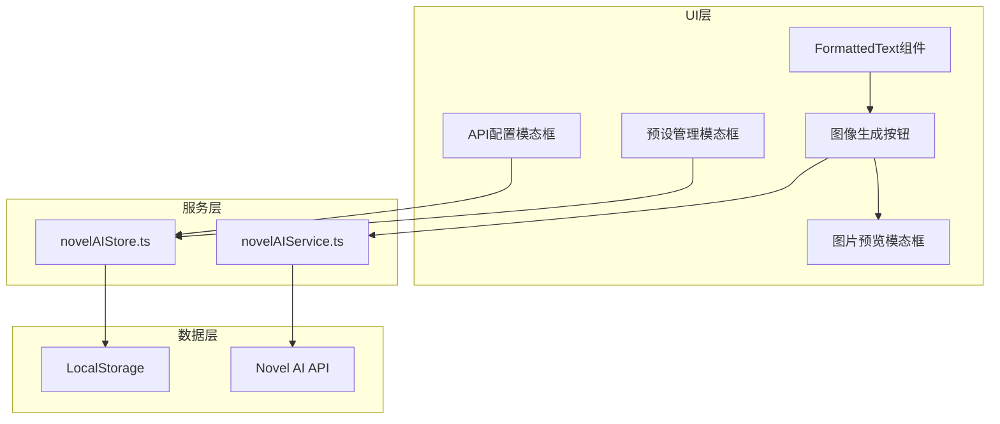
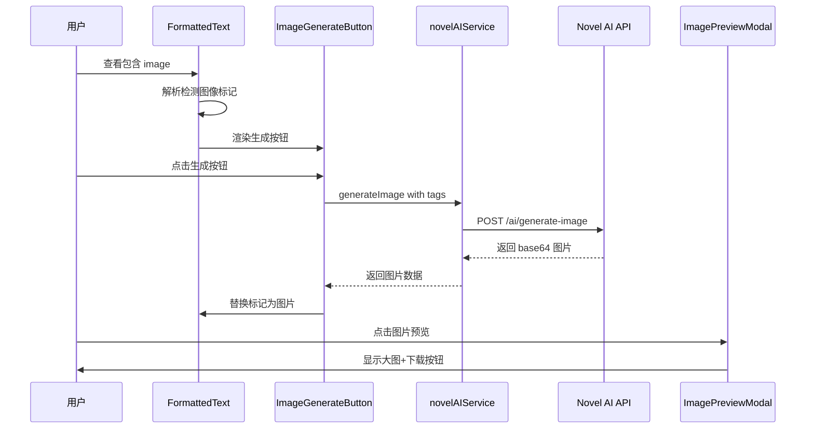
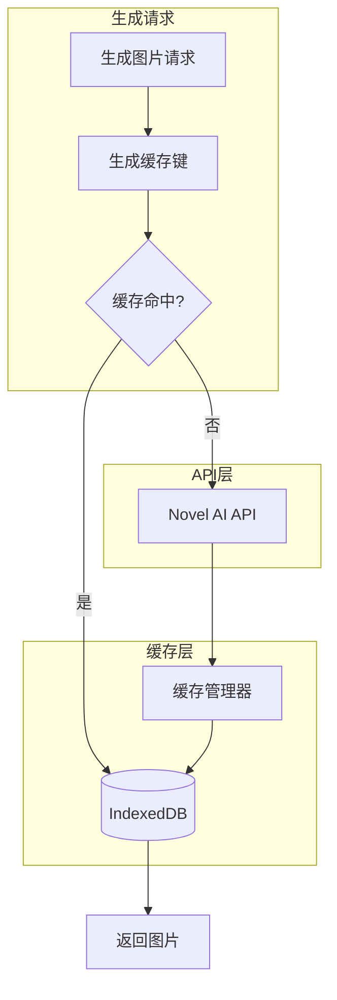

# Novel AI 文生图功能集成方案

## 一、功能概述

将 Novel AI 的图像生成 API 集成到仙途项目中，实现：

1. 在设置界面中配置 Novel AI API
2. 管理正负面提示词预设（支持导入/导出）
3. 检测正文中的图像标记并生成图片
4. 图片预览与下载功能

---

## 二、技术架构

### 2.1 整体架构图



### 2.2 数据流图



---

## 三、详细设计

### 3.1 类型定义 (src/types/novelAI.ts)

```typescript
// Novel AI 配置接口
export interface NovelAIConfig {
  enabled: boolean
  apiKey: string
  site: official | custom
  customUrl?: string
  model: string
  sampler: string
  noiseSchedule: string
  promptGuidance: number // CFG
  variety: boolean
  aiDefaultPosition: boolean

  // 尺寸设置
  sizePreset: string
  width: number
  height: number

  // 渲染控制
  steps: number
  seed: number // 0 = 随机

  // 标记设置
  startMarker: string // 默认: image###
  endMarker: string // 默认: ###
  autoGenerate: boolean // 自动点击生成按钮
}

// 提示词预设接口
export interface NovelAIPromptPreset {
  name: string
  fixedPrompt: string // 固定正面提示词
  fixedPrompt_end: string // 后置固定正面提示词
  negativePrompt: string // 负面提示词
}

// 预设文件格式 - 与用户提供的JSON格式一致
export interface NovelAIPresetFile {
  [presetName: string]: {
    fixedPrompt: string
    fixedPrompt_end: string
    negativePrompt: string
  }
}

// 图像生成请求
export interface NovelAIGenerateRequest {
  tags: string // 从标记中提取的tags
  preset?: string // 使用的预设名称
  width?: number
  height?: number
  seed?: number
}

// 图像生成响应
export interface NovelAIGenerateResponse {
  success: boolean
  imageBase64?: string // base64编码的图片
  error?: string
  seed?: number // 实际使用的种子
}
```

### 3.2 Novel AI 服务 (src/services/novelAIService.ts)

```typescript
class NovelAIService {
  private config: NovelAIConfig
  private presets: Map<string, NovelAIPromptPreset>

  // 配置管理
  loadConfig(): NovelAIConfig
  saveConfig(config: NovelAIConfig): void
  getConfig(): NovelAIConfig

  // 预设管理
  loadPresets(): NovelAIPromptPreset[]
  savePreset(preset: NovelAIPromptPreset): void
  deletePreset(name: string): void
  importPresets(file: File): Promise<NovelAIPromptPreset[]>
  exportPresets(): string // JSON string

  // 图像生成
  async generateImage(request: NovelAIGenerateRequest): Promise<NovelAIGenerateResponse>

  // API调用
  private buildPrompt(tags: string, preset?: NovelAIPromptPreset): string
  private callNovelAIAPI(params: object): Promise<Blob>
}
```

### 3.3 Novel AI Store (src/stores/novelAIStore.ts)

使用 Pinia 管理状态：

```typescript
export const useNovelAIStore = defineStore('novelAI', {
  state: () => ({
    config: getDefaultConfig(),
    presets: [] as NovelAIPromptPreset[],
    currentPreset: null as string | null,
    generatingImages: new Map<string, boolean>(),  // 按标记ID跟踪
    generatedImages: new Map<string, string>(),    // 标记ID -> base64
  }),

  actions: {
    // 配置操作
    updateConfig(config: Partial<NovelAIConfig>): void

    // 预设操作
    addPreset(preset: NovelAIPromptPreset): void
    removePreset(name: string): void
    selectPreset(name: string): void

    // 生成操作
    async generateForMarker(markerId: string, tags: string): Promise<string>
    setImageForMarker(markerId: string, base64: string): void
    isGenerating(markerId: string): boolean
    getImage(markerId: string): string | null
  }
})
```

### 3.4 API 配置界面扩展

在现有 [`APIConfigModal.vue`](src/components/common/APIConfigModal.vue:1) 中添加新的标签页：

```vue
<!-- 新增标签页 -->
<button class="tab-btn" :class="{ active: activeTab === 'novelai' }" @click="activeTab = 'novelai'">
  <span class="tab-icon">🎨</span>
  <span class="tab-label">图像生成</span>
  <span v-if="draftConfig.novelAI?.enabled" class="tab-badge">已启用</span>
</button>
```

配置项布局：

```
┌────────────────────────────────────────────────────┐
│ 🎨 Novel AI 图像生成配置                            │
├────────────────────────────────────────────────────┤
│ ○ 启用图像生成  [开关]                              │
├────────────────────────────────────────────────────┤
│ 【模型与接口】                                      │
│ API Key:        [************************]         │
│ 站点:           [官网 ▼]                           │
│ 模型:           [nai-diffusion-3 ▼]                │
├────────────────────────────────────────────────────┤
│ 【采样与算法】                                      │
│ 采样方法:       [k_euler ▼]                        │
│ 噪点表:         [native ▼]                         │
│ 提示词引导CFG:  [────●────] 5.0                    │
│ 多样性:         [开关] 已开启                       │
├────────────────────────────────────────────────────┤
│ 【尺寸与比例】                                      │
│ 预设尺寸:       [Normal Portrait ▼]                │
│ 宽度:           [832]                              │
│ 高度:           [1216]                             │
├────────────────────────────────────────────────────┤
│ 【渲染控制】                                        │
│ 生成步数:       [────●────] 28                     │
│ 种子:           [0] (0=随机)                       │
├────────────────────────────────────────────────────┤
│ 【标记设置】                                        │
│ 开始标记:       [image###]                         │
│ 结束标记:       [###]                              │
│ 自动生成:       [开关] 检测到标记时自动生成          │
├────────────────────────────────────────────────────┤
│ 【提示词预设】                                      │
│ 当前预设:       [质感鲜艳二次元 ▼]    [管理预设]    │
│                                                    │
│ [🔧 测试连接]  [✓ 成功]                            │
└────────────────────────────────────────────────────┘
```

### 3.5 提示词预设管理组件 (NovelAIPresetModal.vue)

```
┌────────────────────────────────────────────────────┐
│ 提示词预设管理                              [×]    │
├────────────────────────────────────────────────────┤
│ 【预设列表】                                        │
│ ┌──────────────────────────────────────────────┐  │
│ │ ● 质感鲜艳二次元              [编辑] [删除]  │  │
│ │ ○ 写实风格                    [编辑] [删除]  │  │
│ │ ○ 水彩画风                    [编辑] [删除]  │  │
│ └──────────────────────────────────────────────┘  │
│                                                    │
│ [+ 新建预设]  [📥 导入]  [📤 导出]                  │
├────────────────────────────────────────────────────┤
│ 【编辑预设】                                        │
│ 预设名称:     [质感鲜艳二次元]                      │
│                                                    │
│ 固定正面提示词:                                     │
│ ┌──────────────────────────────────────────────┐  │
│ │ 5::masterpiece, best quality ::,            │  │
│ │ 2::official art, year2024, year2025 ::,...  │  │
│ └──────────────────────────────────────────────┘  │
│                                                    │
│ 后置正面提示词:                                     │
│ ┌──────────────────────────────────────────────┐  │
│ │                                              │  │
│ └──────────────────────────────────────────────┘  │
│                                                    │
│ 负面提示词:                                         │
│ ┌──────────────────────────────────────────────┐  │
│ │ 2::artist collaboration::,low quality,...   │  │
│ └──────────────────────────────────────────────┘  │
├────────────────────────────────────────────────────┤
│                              [取消]  [保存预设]    │
└────────────────────────────────────────────────────┘
```

### 3.6 FormattedText 组件扩展

在 [`FormattedText.vue`](src/components/common/FormattedText.vue) 中添加新的文本类型：

```typescript
interface TextPart {
  type:
    | 'environment'
    | 'psychology'
    | 'dialogue'
    | 'judgement-card'
    | 'normal'
    | 'quote'
    | 'image-marker' // 新增
  content: string | JudgementData | ImageMarkerData
}

interface ImageMarkerData {
  markerId: string // 唯一标识符
  tags: string // 提取的标签
  rawMarker: string // 原始标记文本
}
```

解析逻辑（伪代码）：

```typescript
const parseImageMarkers = (text: string) => {
  const startMarker = novelAIStore.config.startMarker // e.g., 'image###'
  const endMarker = novelAIStore.config.endMarker // e.g., '###'

  const regex = new RegExp(escapeRegex(startMarker) + '(.+?)' + escapeRegex(endMarker), 'gs')

  return text.replace(regex, (match, tags) => {
    return `<image-marker id="${generateId()}" tags="${tags}"/>`
  })
}
```

### 3.7 图像生成按钮组件 (ImageGenerateButton.vue)

```vue
<template>
  <div class="image-generate-wrapper">
    <!-- 未生成时显示按钮 -->
    <button v-if="!generatedImage && !isGenerating" class="generate-btn" @click="handleGenerate">
      <ImageIcon :size="16" />
      <span>生成图片</span>
      <span class="tags-preview">{{ truncatedTags }}</span>
    </button>

    <!-- 生成中显示加载状态 -->
    <div v-else-if="isGenerating" class="generating">
      <Loader2 class="spin" :size="20" />
      <span>生成中...</span>
    </div>

    <!-- 已生成显示图片 -->
    <div v-else class="generated-image" @click="openPreview">
      
      <div class="image-overlay">
        <ZoomIn :size="20" />
      </div>
    </div>
  </div>
</template>
```

### 3.8 图片预览模态框 (ImagePreviewModal.vue)

```vue
<template>
  <div v-if="open" class="preview-overlay" @click.self="close">
    <div class="preview-container">
      <button class="close-btn" @click="close">×</button>

      <div class="image-wrapper">
        
      </div>

      <div class="preview-actions">
        <button class="download-btn" @click="download">
          <Download :size="20" />
          <span>下载图片</span>
        </button>
        <button class="regenerate-btn" @click="regenerate">
          <RefreshCw :size="20" />
          <span>重新生成</span>
        </button>
      </div>

      <div class="image-info">
        <span>尺寸: {{ width }} × {{ height }}</span>
        <span>种子: {{ seed }}</span>
      </div>
    </div>
  </div>
</template>
```

---

## 四、Novel AI API 集成细节

### 4.1 API 端点

- 官方端点: `https://api.novelai.net/ai/generate-image`
- 认证: `Authorization: Bearer {api_key}`

### 4.2 请求格式

```typescript
interface NovelAIAPIRequest {
  input: string // 正面提示词
  model: string // 模型名称
  action: 'generate' // 固定值
  parameters: {
    width: number
    height: number
    scale: number // CFG/Prompt Guidance
    sampler: string
    steps: number
    seed: number
    n_samples: number
    ucPreset: number
    qualityToggle: boolean
    sm: boolean // 多样性
    sm_dyn: boolean
    negative_prompt: string
    noise_schedule: string
  }
}
```

### 4.3 响应处理

API 返回 ZIP 格式的响应，包含生成的图片：

```typescript
async function parseNovelAIResponse(response: Response): Promise<string> {
  const blob = await response.blob()
  const zip = await JSZip.loadAsync(blob)
  const imageFile = Object.values(zip.files)[0]
  const base64 = await imageFile.async('base64')
  return `data:image/png;base64,${base64}`
}
```

### 4.4 模型与采样器选项

```typescript
const MODELS = [
  { value: 'nai-diffusion-3', label: 'NAI Diffusion Anime V3' },
  { value: 'nai-diffusion-furry-3', label: 'NAI Diffusion Furry V3' },
  { value: 'nai-diffusion-2', label: 'NAI Diffusion V2' },
]

const SAMPLERS = [
  { value: 'k_euler', label: 'Euler' },
  { value: 'k_euler_ancestral', label: 'Euler Ancestral' },
  { value: 'k_dpmpp_2s_ancestral', label: 'DPM++ 2S Ancestral' },
  { value: 'k_dpmpp_2m', label: 'DPM++ 2M' },
  { value: 'k_dpmpp_sde', label: 'DPM++ SDE' },
  { value: 'ddim_v3', label: 'DDIM' },
]

const NOISE_SCHEDULES = [
  { value: 'native', label: 'Native' },
  { value: 'karras', label: 'Karras' },
  { value: 'exponential', label: 'Exponential' },
  { value: 'polyexponential', label: 'Polyexponential' },
]

const SIZE_PRESETS = [
  { value: 'portrait', label: 'Portrait (832×1216)', width: 832, height: 1216 },
  { value: 'landscape', label: 'Landscape (1216×832)', width: 1216, height: 832 },
  { value: 'square', label: 'Square (1024×1024)', width: 1024, height: 1024 },
  { value: 'wide', label: 'Wide (1536×640)', width: 1536, height: 640 },
  { value: 'custom', label: '自定义', width: 0, height: 0 },
]
```

---

## 五、实施步骤

### 阶段1: 基础设施

1. 创建类型定义文件 `src/types/novelAI.ts`
2. 创建服务类 `src/services/novelAIService.ts`
3. 创建状态管理 `src/stores/novelAIStore.ts`

### 阶段2: 配置界面

4. 在 `APIConfigModal.vue` 中添加 Novel AI 标签页
5. 实现所有配置项的 UI 和数据绑定
6. 实现 API 连接测试功能

### 阶段3: 预设管理

7. 创建 `NovelAIPresetModal.vue` 组件
8. 实现预设的增删改查
9. 实现 JSON 格式的导入导出（兼容用户提供的格式）

### 阶段4: 图像生成

10. 扩展 `FormattedText.vue` 解析图像标记
11. 创建 `ImageGenerateButton.vue` 组件
12. 实现自动生成功能（可选）

### 阶段5: 预览与下载

13. 创建 `ImagePreviewModal.vue` 组件
14. 实现图片下载功能
15. 实现重新生成功能

### 阶段6: 测试与优化

16. 端到端功能测试
17. 错误处理优化
18. 性能优化（图片缓存）

---

## 六、文件清单

| 文件路径                                        | 类型 | 描述                     |
| ----------------------------------------------- | ---- | ------------------------ |
| `src/types/novelAI.ts`                          | 新建 | 类型定义                 |
| `src/services/novelAIService.ts`                | 新建 | API 服务类               |
| `src/stores/novelAIStore.ts`                    | 新建 | Pinia 状态管理           |
| `src/components/common/APIConfigModal.vue`      | 修改 | 添加 Novel AI 配置标签页 |
| `src/components/common/NovelAIPresetModal.vue`  | 新建 | 预设管理模态框           |
| `src/components/common/FormattedText.vue`       | 修改 | 添加图像标记解析         |
| `src/components/common/ImageGenerateButton.vue` | 新建 | 图像生成按钮             |
| `src/components/common/ImagePreviewModal.vue`   | 新建 | 图片预览模态框           |
| `src/services/aiService.ts`                     | 修改 | AIConfig 类型扩展        |

---

## 七、图片缓存系统设计

### 7.1 缓存策略概述

为避免重复生成相同的图片，实现基于 IndexedDB 的图片缓存系统：



### 7.2 缓存键设计

缓存键基于以下参数生成 SHA-256 哈希：

```typescript
interface CacheKeyParams {
  tags: string // 用户输入的标签
  presetName: string // 使用的预设名称
  fixedPrompt: string // 固定正面提示词
  fixedPrompt_end: string // 后置正面提示词
  negativePrompt: string // 负面提示词
  model: string // 模型
  sampler: string // 采样方法
  width: number // 宽度
  height: number // 高度
  steps: number // 步数
  cfg: number // CFG
  seed: number // 种子 (非0时才纳入)
}

function generateCacheKey(params: CacheKeyParams): string {
  const keyString = JSON.stringify(params)
  return sha256(keyString)
}
```

**注意**: 当 seed = 0（随机）时，每次生成结果不同，不缓存。

### 7.3 IndexedDB 数据结构

```typescript
interface ImageCacheEntry {
  id: string // 缓存键 (hash)
  imageBase64: string // base64 图片数据
  tags: string // 原始标签（用于显示）
  presetName: string // 预设名称
  width: number
  height: number
  seed: number // 实际使用的种子
  createdAt: number // 创建时间戳
  lastAccessedAt: number // 最后访问时间戳
  size: number // 图片大小 (bytes)
}

// IndexedDB Schema
const DB_NAME = 'NovelAIImageCache'
const DB_VERSION = 1
const STORE_NAME = 'images'
```

### 7.4 缓存服务 (src/services/imageCacheService.ts)

```typescript
class ImageCacheService {
  private db: IDBDatabase | null = null
  private readonly MAX_CACHE_SIZE = 100 * 1024 * 1024 // 100MB
  private readonly MAX_ENTRIES = 200 // 最多200张图
  private readonly EXPIRY_DAYS = 30 // 30天过期

  // 初始化数据库
  async init(): Promise<void>

  // 获取缓存
  async get(cacheKey: string): Promise<ImageCacheEntry | null>

  // 存储缓存
  async set(entry: ImageCacheEntry): Promise<void>

  // 删除单个缓存
  async delete(cacheKey: string): Promise<void>

  // 清理过期缓存
  async cleanExpired(): Promise<number>

  // 基于 LRU 策略清理
  async cleanLRU(targetSize: number): Promise<number>

  // 获取缓存统计
  async getStats(): Promise<{
    totalEntries: number
    totalSize: number
    oldestEntry: Date | null
  }>

  // 清空所有缓存
  async clearAll(): Promise<void>
}

export const imageCacheService = new ImageCacheService()
```

### 7.5 缓存流程集成

在 [`novelAIService.ts`](src/services/novelAIService.ts) 中集成缓存：

```typescript
async generateImage(request: NovelAIGenerateRequest): Promise<NovelAIGenerateResponse> {
  // 1. 构建缓存键参数
  const cacheParams = this.buildCacheKeyParams(request)

  // 2. 仅当 seed != 0 时检查缓存
  if (request.seed !== 0) {
    const cacheKey = generateCacheKey(cacheParams)
    const cached = await imageCacheService.get(cacheKey)

    if (cached) {
      console.log('[NovelAI] 缓存命中:', cacheKey.substring(0, 8))
      return {
        success: true,
        imageBase64: cached.imageBase64,
        seed: cached.seed,
        fromCache: true
      }
    }
  }

  // 3. 调用 API 生成
  const result = await this.callNovelAIAPI(request)

  // 4. 存入缓存（无论 seed 是否为0，都用实际返回的 seed 存储）
  if (result.success && result.imageBase64) {
    const actualSeed = result.seed || 0
    if (actualSeed !== 0) {
      // 用实际 seed 重新生成缓存键
      const finalParams = { ...cacheParams, seed: actualSeed }
      const finalKey = generateCacheKey(finalParams)

      await imageCacheService.set({
        id: finalKey,
        imageBase64: result.imageBase64,
        tags: request.tags,
        presetName: request.preset || '',
        width: request.width || this.config.width,
        height: request.height || this.config.height,
        seed: actualSeed,
        createdAt: Date.now(),
        lastAccessedAt: Date.now(),
        size: result.imageBase64.length
      })
    }
  }

  return result
}
```

### 7.6 UI 缓存状态显示

在 `ImageGenerateButton.vue` 中显示缓存状态：

```vue
<template>
  <div class="image-generate-wrapper">
    <!-- 已生成显示图片 -->
    <div v-if="generatedImage" class="generated-image" @click="openPreview">
      
      <div class="image-overlay">
        <ZoomIn :size="20" />
      </div>
      <!-- 缓存标识 -->
      <div v-if="fromCache" class="cache-badge" title="来自缓存">
        <Database :size="12" />
      </div>
    </div>
    <!-- ... -->
  </div>
</template>
```

### 7.7 缓存管理界面

在设置面板中添加缓存管理功能：

```
┌────────────────────────────────────────────────────┐
│ 【缓存管理】                                        │
│ 已缓存图片：42 张                                   │
│ 缓存大小：23.5 MB / 100 MB                         │
│ 最早缓存：2024-01-15                               │
│                                                    │
│ [清理过期缓存]  [清空所有缓存]                       │
└────────────────────────────────────────────────────┘
```

---

## 八、风险与注意事项

1. **API 限制**: Novel AI 有请求频率限制，需要实现请求队列
2. **图片大小**: Base64 图片较大，使用 IndexedDB 缓存（已设计）
3. **跨域问题**: 可能需要代理服务器处理 CORS
4. **错误处理**: API 调用失败时提供清晰的错误提示
5. **预设兼容**: 确保与 SillyTavern 预设格式兼容
6. **缓存一致性**: 预设更新后可能导致缓存失效，通过完整参数哈希解决

---

## 九、用户体验考虑

1. 首次使用引导提示
2. 生成中显示进度/预估时间
3. 生成失败时保留原始标记，允许重试
4. 图片懒加载优化
5. 移动端适配
6. 缓存命中时显示"来自缓存"标识，响应更快
7. 缓存统计和管理界面
