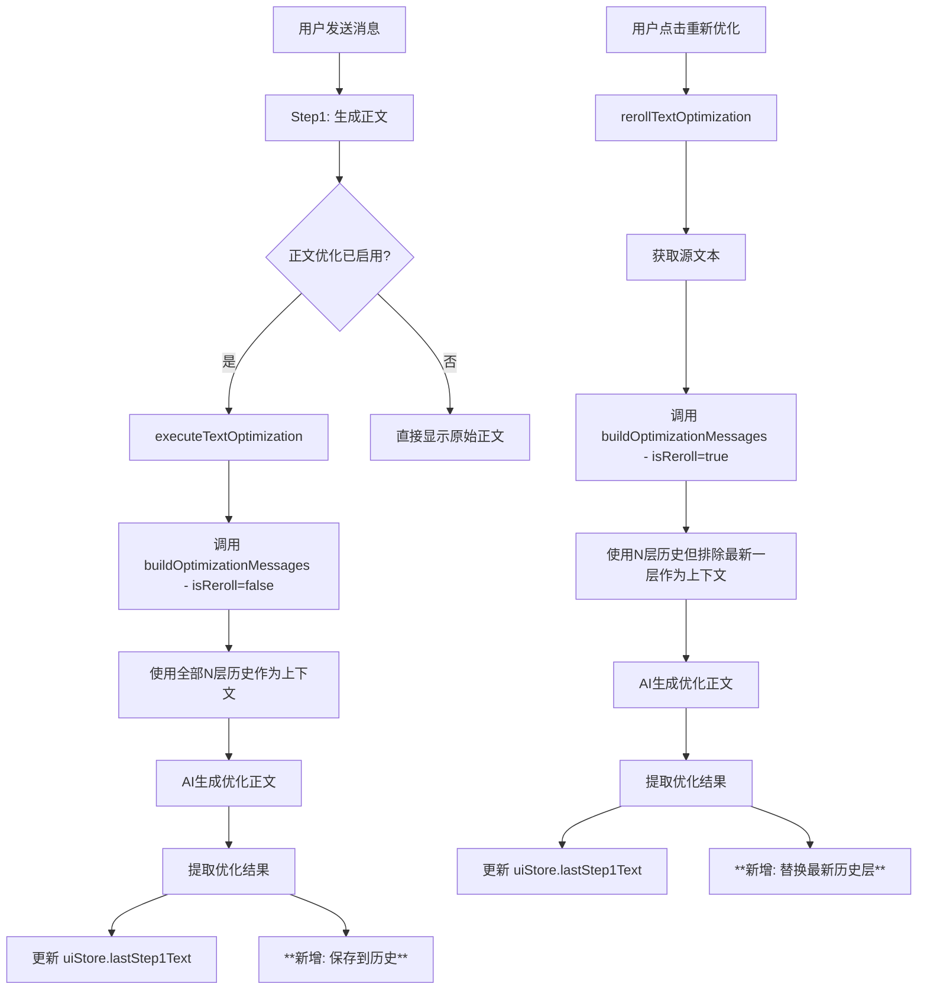

# 优化正文历史存储功能实现计划

## 功能需求

1. **优化后正文存储**：保存最近10层优化后的正文
2. **Re-roll替换逻辑**：重新优化正文时替换最新一层，而非新增
3. **上下文增强**：生成优化正文时使用"最新第一步正文 + 配置的最新X层历史优化正文"作为上下文
4. **Re-roll排除最新层**：Re-roll时不将刚生成的最新优化正文算进历史上下文
5. **配置集成**：在记忆设置中添加对应的层数配置

## 架构分析

### 当前状态

- [`textOptimizationService.ts`](../src/services/textOptimizationService.ts) - 管理优化预设和条目
- [`AIBidirectionalSystem.ts`](../src/utils/AIBidirectionalSystem.ts) - 执行文本优化（第1872-1948行）和重新优化（第2266-2348行）
- [`promptPreviewService.ts`](../src/services/promptPreviewService.ts) - 管理记忆配置（`ShortTermMemoryConfig`）
- [`MemoryPromptConfig.vue`](../src/components/dashboard/prompt-management/MemoryPromptConfig.vue) - 记忆配置UI
- [`uiStore.ts`](../src/stores/uiStore.ts) - 存储`lastStep1Text`等状态

### 数据流



### 关键逻辑说明

**首次优化 vs Re-roll 的历史上下文区别：**

| 场景     | 历史状态    | 配置层数 | 使用的历史 | 说明                     |
| -------- | ----------- | -------- | ---------- | ------------------------ |
| 首次优化 | [1,2,3,4,5] | 3        | [3,4,5]    | 使用最新3层作为参考      |
| Re-roll  | [1,2,3,4,5] | 3        | [2,3,4]    | 排除最新层5，使用前面3层 |

这样设计的原因：

- Re-roll时，第5层是要被重新生成的目标，不应该作为参考上下文
- 如果把第5层也传给AI，会导致AI可能模仿自己刚生成的"不满意"的内容

## 详细实现计划

### 1. 扩展 textOptimizationService.ts

在 [`src/services/textOptimizationService.ts`](../src/services/textOptimizationService.ts) 中添加：

```typescript
// 新增存储键
const HISTORY_KEY = 'text_optimization_history';
const MAX_HISTORY_SIZE = 10;

// 新增私有属性
private optimizedTextHistory: string[] = [];

// 新增方法
/**
 * 添加优化后的正文到历史（用于首次优化）
 */
addOptimizedText(text: string): void {
  this.optimizedTextHistory.push(text);
  // 保持最多10层
  if (this.optimizedTextHistory.length > MAX_HISTORY_SIZE) {
    this.optimizedTextHistory.shift();
  }
  this.saveHistory();
}

/**
 * 替换最新一层优化正文（用于re-roll）
 */
replaceLatestOptimizedText(text: string): void {
  if (this.optimizedTextHistory.length > 0) {
    this.optimizedTextHistory[this.optimizedTextHistory.length - 1] = text;
  } else {
    this.optimizedTextHistory.push(text);
  }
  this.saveHistory();
}

/**
 * 获取最新N层历史优化正文
 * @param count 需要的层数
 * @param excludeLatest 是否排除最新一层（Re-roll时使用）
 */
getOptimizedTextHistory(count: number, excludeLatest: boolean = false): string[] {
  if (count <= 0) return [];

  if (excludeLatest && this.optimizedTextHistory.length > 0) {
    // Re-roll场景：排除最新一层，从倒数第二层开始取
    const historyWithoutLatest = this.optimizedTextHistory.slice(0, -1);
    return historyWithoutLatest.slice(-count);
  }

  // 首次优化场景：正常取最新N层
  return this.optimizedTextHistory.slice(-count);
}

/**
 * 清空历史
 */
clearHistory(): void {
  this.optimizedTextHistory = [];
  localStorage.removeItem(HISTORY_KEY);
}

/**
 * 保存历史到localStorage
 */
private saveHistory(): void {
  localStorage.setItem(HISTORY_KEY, JSON.stringify(this.optimizedTextHistory));
}

/**
 * 从localStorage加载历史
 */
private loadHistory(): void {
  try {
    const saved = localStorage.getItem(HISTORY_KEY);
    if (saved) {
      this.optimizedTextHistory = JSON.parse(saved);
    }
  } catch (e) {
    console.warn('[TextOptimizationService] 加载优化历史失败:', e);
    this.optimizedTextHistory = [];
  }
}
```

### 2. 修改 buildOptimizationMessages 方法

修改 [`buildOptimizationMessages()`](../src/services/textOptimizationService.ts:120) 方法，添加历史上下文支持：

```typescript
/**
 * 构建优化消息（增加历史上下文参数）
 * @param originalText 原始正文（Step1最新生成的）
 * @param historyCount 要包含的历史优化正文层数（从配置获取）
 * @param isReroll 是否为Re-roll场景（Re-roll时需排除最新一层历史）
 */
buildOptimizationMessages(
  originalText: string,
  historyCount: number = 0,
  isReroll: boolean = false
): Array<{ role: 'system' | 'user' | 'assistant'; content: string }> {
  const messages: Array<{ role: 'system' | 'user' | 'assistant'; content: string }> = [];

  // ... 现有的逻辑保持不变 ...

  // 新增：如果配置了历史层数，添加历史优化正文作为上下文
  if (historyCount > 0) {
    // Re-roll时排除最新一层（因为那是要被替换的）
    const history = this.getOptimizedTextHistory(historyCount, isReroll);
    if (history.length > 0) {
      const historyContext = history.map((text, index) =>
        `【历史优化正文 ${index + 1}】\n${text}`
      ).join('\n\n');

      messages.push({
        role: 'system',
        content: `以下是之前的优化正文历史，作为风格参考：\n\n${historyContext}`
      });
    }
  }

  // ... 继续现有的逻辑 ...
}
```

### 3. 扩展 promptPreviewService.ts

在 [`src/services/promptPreviewService.ts`](../src/services/promptPreviewService.ts) 中修改：

```typescript
// 修改 ShortTermMemoryConfig 接口（第66-74行）
export interface ShortTermMemoryConfig {
  textGenerationCount: number
  variableGenerationCount: number
  variableRerollCount: number
  textOptimizationCount: number
  textOptimizationRerollCount: number
  tavernPresetCount: number
  promptTemplate: string
  // 新增
  optimizedTextHistoryCount: number // 优化正文历史层数（用于生成时的上下文）
}

// 更新 DEFAULT_MEMORY_CONFIG
const DEFAULT_MEMORY_CONFIG: ShortTermMemoryConfig = {
  textGenerationCount: 3,
  variableGenerationCount: 3,
  variableRerollCount: 3,
  textOptimizationCount: 0,
  textOptimizationRerollCount: 0,
  tavernPresetCount: 5,
  promptTemplate: DEFAULT_MEMORY_TEMPLATE,
  // 新增
  optimizedTextHistoryCount: 3, // 默认使用3层历史
}
```

### 4. 更新 AIBidirectionalSystem.ts

#### 4.1 修改 executeTextOptimization（第1872-1948行）

在优化完成后添加历史保存：

```typescript
// 获取配置的历史层数
const memoryConfig = promptPreviewService.getMemoryConfig()
const historyCount = memoryConfig.optimizedTextHistoryCount || 0

// 调用时传入历史层数，isReroll=false（首次优化）
const messages = textOptimizationService.buildOptimizationMessages(
  originalText,
  historyCount,
  false, // isReroll = false
)

// ... AI调用 ...

// 在 completeTextOptimization 之后（约第1938行）
uiStore.completeTextOptimization(finalText)
uiStore.lastStep1Text = finalText

// 新增：保存到历史
textOptimizationService.addOptimizedText(finalText)
console.log('[executeTextOptimization] 已保存优化正文到历史')
```

#### 4.2 修改 rerollTextOptimization（第2266-2348行）

替换最新层而非新增：

```typescript
// 获取配置的历史层数
const memoryConfig = promptPreviewService.getMemoryConfig()
const historyCount = memoryConfig.optimizedTextHistoryCount || 0

// 调用时传入历史层数，并标记 isReroll=true（排除最新一层历史）
const messages = textOptimizationService.buildOptimizationMessages(
  sourceText,
  historyCount,
  true, // isReroll = true，排除最新层
)

// ... AI调用 ...

// 在 completeRerollOptimization 之后（约第2318行）
uiStore.completeRerollOptimization(finalText)
uiStore.lastStep1Text = finalText

// 修改：替换最新层（而非添加新层）
textOptimizationService.replaceLatestOptimizedText(finalText)
console.log('[rerollTextOptimization] 已替换最新优化正文历史层')
```

### 5. 更新 MemoryPromptConfig.vue

在 [`src/components/dashboard/prompt-management/MemoryPromptConfig.vue`](../src/components/dashboard/prompt-management/MemoryPromptConfig.vue) 中添加新配置项：

#### 5.1 更新模板（在config-grid-6后添加新section）

```vue
<!-- 优化正文历史配置 -->
<div class="config-section">
  <div class="section-header">
    <span class="section-title">优化正文历史配置</span>
    <button class="clear-btn" @click="clearOptimizationHistory">
      清空历史
    </button>
  </div>
  <div class="config-grid-2">
    <div class="config-item">
      <label>生成时使用历史层数</label>
      <input
        type="number"
        v-model.number="config.optimizedTextHistoryCount"
        min="0"
        max="10"
        @change="saveConfig"
        class="number-input"
      />
      <span class="unit">层</span>
    </div>
    <div class="config-item">
      <label>当前历史层数</label>
      <span class="history-count">{{ optimizationHistoryCount }} / 10</span>
    </div>
  </div>
  <p class="config-hint">
    优化正文时会将历史优化正文作为风格参考传递给AI。设为0则不使用历史。最多保存10层。Re-roll时会自动排除最新一层。
  </p>
</div>
```

#### 5.2 添加计算属性和方法

```typescript
import { textOptimizationService } from '@/services/textOptimizationService'

// 优化历史条数
const optimizationHistoryCount = computed(() => {
  return textOptimizationService.getOptimizedTextHistory(10).length
})

// 清空优化历史
const clearOptimizationHistory = () => {
  if (confirm('确定要清空所有优化正文历史吗？')) {
    textOptimizationService.clearHistory()
    toast.success('已清空优化正文历史')
  }
}
```

#### 5.3 更新配置对象默认值

```typescript
const config = ref<ShortTermMemoryConfig>({
  textGenerationCount: 3,
  variableGenerationCount: 3,
  variableRerollCount: 3,
  textOptimizationCount: 0,
  textOptimizationRerollCount: 0,
  tavernPresetCount: 5,
  promptTemplate: '',
  optimizedTextHistoryCount: 3, // 新增
})
```

## 实现顺序

1. **textOptimizationService.ts** - 添加历史存储功能和相关方法
2. **promptPreviewService.ts** - 扩展配置接口，添加 `optimizedTextHistoryCount`
3. **AIBidirectionalSystem.ts** - 修改 `executeTextOptimization` 和 `rerollTextOptimization`
4. **MemoryPromptConfig.vue** - 添加UI配置和清空功能

## 测试要点

1. **历史存储测试**
   - 验证优化正文正确保存到历史
   - 验证超过10层时自动移除最早的
   - 验证刷新页面后历史仍在

2. **Re-roll测试**
   - 验证Re-roll替换最新层而非新增
   - 验证Re-roll后历史长度不变
   - **验证Re-roll时历史上下文不包含最新层**

3. **上下文测试**
   - 验证生成时历史正确传入AI
   - 验证历史层数配置生效
   - 验证设为0时不传历史
   - **验证首次优化和Re-roll使用的历史不同**

4. **UI测试**
   - 验证配置正确保存和加载
   - 验证清空历史功能正常
   - 验证历史层数显示正确

## 兼容性考虑

- 首次加载时 `optimizedTextHistoryCount` 可能不存在，需要提供默认值
- 历史数据格式简单（字符串数组），无需复杂迁移

## 关键设计决策

- **最大历史层数**: 固定为10层，超出自动移除最早的
- **历史用途**: 作为风格参考传递给AI，帮助保持一致性
- **Re-roll行为**: 替换而非新增，避免历史被重复内容占满
- **Re-roll上下文**: Re-roll时排除最新一层历史，避免AI模仿"不满意"的内容
- **配置灵活性**: 用户可配置使用0-10层历史，设为0则不使用历史
