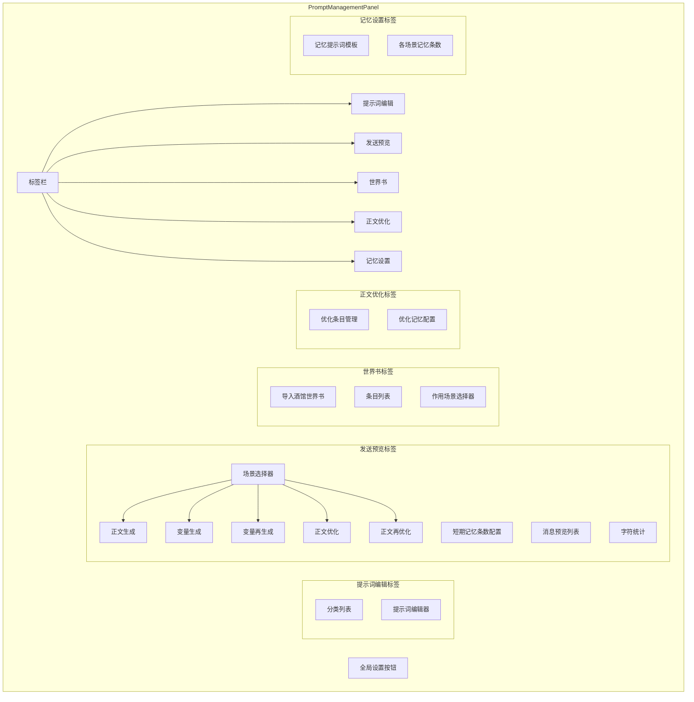

# 提示词管理系统改进计划

## 📋 需求分析

### 用户反馈的问题

1. **不直观**：不知道生成正文时除了发送提示词还发送了什么（如短期记忆层数）
2. **缺少整体视图**：无法看到完整的发送顺序
3. **缺少预览**：不知道生成独立变量、重新生成独立变量时会发送什么
4. **正文优化不透明**：不知道优化正文时会发送什么
5. **配置分散**：正文优化设置在单独的弹窗中，与提示词管理分离
6. **世界书功能不完善**：需要支持导入酒馆世界书，并选择作用场景

### 改进目标

- 提供完整发送预览（正文生成、变量生成/再生成、正文优化/再优化）
- 显示每个消息的角色、内容、字符数
- 统计总字符数
- 可配置各场景使用的短期记忆数量
- 自定义短期记忆的提示词模板
- 将正文优化设置整合到提示词管理界面
- 支持导入酒馆世界书，并选择作用场景（正文/变量/优化）
- 一键导出导入全部设置

---

## 🔍 现有系统分析

### 1. 核心文件结构

```
src/
├── components/dashboard/
│   └── PromptManagementPanel.vue     # 当前提示词管理UI
├── services/
│   ├── promptStorage.ts              # IndexedDB提示词存储
│   ├── defaultPrompts.ts             # 默认提示词定义
│   ├── aiService.ts                  # AI服务（API调用）
│   └── textOptimizationService.ts    # 正文优化服务
├── utils/
│   └── AIBidirectionalSystem.ts      # AI双向系统（核心请求处理）
└── types/
    └── textOptimization.ts           # 正文优化类型定义
```

### 2. 生成模式的消息组装逻辑

#### 模式A：正文生成（Step1 或 标准模式）

**位置**：[`AIBidirectionalSystem.ts:processPlayerAction()`](src/utils/AIBidirectionalSystem.ts:92)

**消息组装顺序**：

1. **系统提示词** (depth: 4, role: system)
   - `assembleSystemPrompt()` 组装的完整系统提示词
   - 包含：coreOutputRules, businessRules, dataDefinitions, textFormatRules, worldStandards
   - 核心状态速览
   - 游戏状态JSON

2. **短期记忆** (depth: 2, role: assistant)
   - 格式：`# 【最近事件】\n${shortTermMemory.join('\n')}`
   - 条数由 `maxShortTermMemories` 控制（默认3条）

3. **CoT提示词** (depth: 1, role: system) - 可选
   - 仅在 `useSystemCot` 启用时注入

4. **用户输入** (user message)

5. **占位符** (depth: 0, role: assistant)
   - 内容：`</input>`

#### 模式B：独立变量生成（Step2）

**位置**：[`AIBidirectionalSystem.ts:buildSplitSystemPrompt(2)`](src/utils/AIBidirectionalSystem.ts:340)

**消息组装顺序**：

1. **Step2系统提示词** (depth: 4, role: system)
   - splitGenerationStep2
   - coreOutputRules
   - businessRules
   - dataDefinitions
   - textFormatRules
   - worldStandards
   - actionOptions（可选）
   - 游戏状态JSON

2. **短期记忆** (depth: 2, role: assistant)
   - 与正文生成相同

3. **用户输入** (包含第1步正文和思维链)

4. **占位符** (depth: 0, role: assistant)

#### 模式C：正文优化

**位置**：[`textOptimizationService.ts:buildOptimizationMessages()`](src/services/textOptimizationService.ts)

**消息组装顺序**：

1. 按 depth 排序的优化条目
2. 原始正文作为 user 消息

### 3. 当前UI结构

[`PromptManagementPanel.vue`](src/components/dashboard/PromptManagementPanel.vue) 当前结构：

- 按分类显示提示词（coreRequest, summary, initialization, generation）
- 支持编辑/保存/恢复默认
- 缺少预览功能

---

## 🎨 改进方案设计

### 界面架构



### 新增组件结构

```
src/components/dashboard/
├── PromptManagementPanel.vue              # 重构：添加标签页
├── prompt-management/
│   ├── PromptEditTab.vue                  # 提示词编辑标签页
│   ├── SendPreviewTab.vue                 # 发送预览标签页
│   ├── WorldBookTab.vue                   # 世界书标签页（新增）
│   ├── TextOptimizationTab.vue            # 正文优化标签页
│   ├── MemoryPromptConfig.vue             # 记忆设置标签页（新增）
│   ├── GlobalSettingsManager.vue          # 全局设置导出导入（新增）
│   └── components/
│       ├── MessagePreviewCard.vue         # 消息预览卡片
│       ├── CharacterStats.vue             # 字符统计组件
│       └── ScenarioSelector.vue           # 场景选择器
```

### 新增服务

```
src/services/
├── promptPreviewService.ts                # 提示词预览服务
└── globalSettingsService.ts               # 全局设置导出导入服务（新增）
```

---

## 📐 详细设计

### 1. PromptPreviewService（提示词预览服务）

```typescript
// src/services/promptPreviewService.ts

export interface PreviewMessage {
  id: string
  role: 'system' | 'user' | 'assistant'
  content: string
  source: string // 来源说明（如"系统提示词"、"短期记忆"等）
  depth: number // 注入深度
  charCount: number // 字符数
  truncated?: boolean // 是否被截断显示
  fullContent?: string // 完整内容（用于展开查看）
}

export interface PreviewResult {
  messages: PreviewMessage[]
  totalCharCount: number
  estimatedTokens: number // 估算token数（字符数/2.5）
}

export type PreviewScenario =
  | 'text_generation' // 正文生成
  | 'variable_generation' // 变量生成
  | 'variable_reroll' // 重新生成变量
  | 'text_optimization' // 正文优化
  | 'text_optimization_reroll' // 重新优化正文

// 世界书条目作用场景
export type WorldBookTarget = 'text' | 'variable' | 'optimization'

export interface WorldBookEntry {
  id: string
  name: string
  content: string
  role: 'system' | 'user' | 'assistant'
  enabled: boolean
  depth: number
  triggerMode: 'always' | 'keyword'
  keywords: string[]
  order: number
  // 新增：作用场景（可多选）
  targets: WorldBookTarget[]
}

class PromptPreviewService {
  // 生成预览
  async generatePreview(
    scenario: PreviewScenario,
    options?: {
      shortTermMemoryCount?: number // 使用的短期记忆条数
      userInput?: string // 模拟的用户输入
      step1Text?: string // 第一步正文（用于变量生成预览）
    },
  ): Promise<PreviewResult>

  // 获取当前短期记忆
  getShortTermMemories(): string[]

  // 获取当前游戏状态JSON
  getGameStateJson(): string

  // 获取自定义的短期记忆提示词模板
  getShortTermMemoryPromptTemplate(): string

  // 设置自定义的短期记忆提示词模板
  setShortTermMemoryPromptTemplate(template: string): void
}
```

### 2. GlobalSettingsService（全局设置服务）

```typescript
// src/services/globalSettingsService.ts

// 全局设置导出/导入
interface GlobalPromptSettings {
  version: string
  exportedAt: string

  // 提示词配置
  prompts: Record<string, string>

  // 世界书条目
  worldBookEntries: WorldBookEntry[]

  // 正文优化条目
  textOptimizationEntries: TextOptimizationEntry[]

  // 短期记忆配置
  shortTermMemoryConfig: {
    textGenerationCount: number
    variableGenerationCount: number
    textOptimizationCount: number
    promptTemplate: string
  }

  // 其他设置
  settings: {
    splitResponseGeneration: boolean
    enableActionOptions: boolean
    useSystemCot: boolean
  }
}

class GlobalSettingsService {
  // 导出全部设置
  async exportAll(): Promise<GlobalPromptSettings>

  // 导入全部设置
  async importAll(settings: GlobalPromptSettings): Promise<void>

  // 下载为JSON文件
  downloadAsJson(): void

  // 从文件导入
  importFromFile(file: File): Promise<void>
}
```

### 3. SendPreviewTab 组件设计

```vue
<!-- src/components/dashboard/prompt-management/SendPreviewTab.vue -->
<template>
  <div class="send-preview-tab">
    <!-- 场景选择器 -->
    <div class="scenario-selector">
      <div
        v-for="scenario in scenarios"
        :key="scenario.id"
        class="scenario-card"
        :class="{ active: currentScenario === scenario.id }"
        @click="selectScenario(scenario.id)"
      >
        <component :is="scenario.icon" :size="24" />
        <div class="scenario-info">
          <h4>{{ scenario.name }}</h4>
          <p>{{ scenario.description }}</p>
        </div>
      </div>
    </div>

    <!-- 场景列表：
      1. 正文生成
      2. 变量生成
      3. 变量再生成
      4. 正文优化
      5. 正文再优化
    -->

    <!-- 配置区域 -->
    <div class="preview-config">
      <!-- 所有场景都可配置短期记忆条数 -->
      <div class="config-item">
        <label>短期记忆条数</label>
        <input type="number" v-model="memoryCount" min="0" :max="maxMemoryCount" />
        <span class="hint">可用: {{ maxMemoryCount }} 条</span>
      </div>

      <div class="config-item" v-if="showUserInputConfig">
        <label>模拟用户输入</label>
        <input type="text" v-model="mockUserInput" placeholder="输入测试内容..." />
      </div>

      <button class="refresh-btn" @click="refreshPreview">
        <RefreshCw :size="16" />
        刷新预览
      </button>
    </div>

    <!-- 统计信息 -->
    <CharacterStats :result="previewResult" />

    <!-- 消息预览列表 -->
    <div class="message-list">
      <MessagePreviewCard
        v-for="(msg, index) in previewResult?.messages"
        :key="msg.id"
        :message="msg"
        :index="index"
      />
    </div>
  </div>
</template>
```

### 4. MessagePreviewCard 组件设计

```vue
<!-- src/components/dashboard/prompt-management/components/MessagePreviewCard.vue -->
<template>
  <div class="message-card" :class="[message.role]">
    <div class="message-header">
      <div class="header-left">
        <span class="order-badge">#{{ index + 1 }}</span>
        <span class="role-badge" :class="message.role">
          {{ getRoleLabel(message.role) }}
        </span>
        <span class="source-label">{{ message.source }}</span>
      </div>
      <div class="header-right">
        <span class="depth-badge">深度: {{ message.depth }}</span>
        <span class="char-count">{{ formatCharCount(message.charCount) }}</span>
        <button class="expand-btn" @click="toggleExpand">
          <ChevronDown :size="16" :class="{ rotated: expanded }" />
        </button>
      </div>
    </div>

    <div class="message-content" :class="{ expanded }">
      <pre>{{ displayContent }}</pre>
    </div>
  </div>
</template>
```

### 5. WorldBookTab 组件设计（新增）

```vue
<!-- src/components/dashboard/prompt-management/WorldBookTab.vue -->
<template>
  <div class="world-book-tab">
    <!-- 工具栏 -->
    <div class="toolbar">
      <div class="toolbar-left">
        <button class="tool-btn" @click="addEntry">
          <Plus :size="16" />
          添加条目
        </button>
        <button class="tool-btn" @click="importTavernWorldBook">
          <Upload :size="16" />
          导入酒馆世界书
        </button>
        <button class="tool-btn" @click="exportWorldBook">
          <Download :size="16" />
          导出世界书
        </button>
      </div>
      <div class="toolbar-right">
        <span class="entry-count">{{ enabledCount }}/{{ entries.length }} 条启用</span>
      </div>
    </div>

    <!-- 条目列表 -->
    <div class="entries-list">
      <div
        v-for="(entry, index) in entries"
        :key="entry.id"
        class="entry-card"
        :class="{ disabled: !entry.enabled }"
      >
        <div class="entry-header">
          <div class="entry-title-row">
            <label class="switch small">
              <input type="checkbox" v-model="entry.enabled" />
              <span class="slider"></span>
            </label>
            <input v-model="entry.name" class="entry-name-input" placeholder="条目名称" />

            <!-- 作用场景标签（可多选） -->
            <div class="target-badges">
              <label class="target-badge" :class="{ active: entry.targets.includes('text') }">
                <input
                  type="checkbox"
                  :checked="entry.targets.includes('text')"
                  @change="toggleTarget(entry, 'text')"
                />
                <span>📝 正文</span>
              </label>
              <label class="target-badge" :class="{ active: entry.targets.includes('variable') }">
                <input
                  type="checkbox"
                  :checked="entry.targets.includes('variable')"
                  @change="toggleTarget(entry, 'variable')"
                />
                <span>🔢 变量</span>
              </label>
              <label
                class="target-badge"
                :class="{ active: entry.targets.includes('optimization') }"
              >
                <input
                  type="checkbox"
                  :checked="entry.targets.includes('optimization')"
                  @change="toggleTarget(entry, 'optimization')"
                />
                <span>✨ 优化</span>
              </label>
            </div>

            <div class="entry-badges">
              <span
                class="badge trigger"
                :class="entry.triggerMode === 'keyword' ? 'green' : 'blue'"
              >
                {{ entry.triggerMode === 'keyword' ? '🟢 关键词' : '🔵 始终' }}
              </span>
              <span class="badge role" :class="entry.role">
                {{ getRoleLabel(entry.role) }}
              </span>
              <span class="badge depth"> 深度: {{ entry.depth }} </span>
            </div>
          </div>
          <div class="entry-actions">
            <button class="icon-btn" @click="toggleExpand(index)">
              <ChevronDown :size="16" :class="{ rotated: expandedIndex === index }" />
            </button>
            <button class="icon-btn danger" @click="removeEntry(index)">
              <Trash2 :size="16" />
            </button>
          </div>
        </div>

        <!-- 展开的编辑区 -->
        <div v-if="expandedIndex === index" class="entry-body">
          <!-- ... 编辑表单 ... -->
        </div>
      </div>
    </div>
  </div>
</template>
```

### 6. TextOptimizationTab 组件设计

整合现有 `TextOptimizationModal.vue` 的功能，新增短期记忆配置：

```vue
<!-- src/components/dashboard/prompt-management/TextOptimizationTab.vue -->
<template>
  <div class="text-optimization-tab">
    <!-- 全局配置 -->
    <div class="global-config">
      <div class="config-section">
        <h4>优化设置</h4>

        <div class="config-item">
          <label>短期记忆使用数量</label>
          <input type="number" v-model="optimizationMemoryCount" min="0" :max="maxMemoryCount" />
          <span class="hint">
            优化时使用最近 {{ optimizationMemoryCount }} 条短期记忆作为上下文
          </span>
        </div>

        <div class="config-item">
          <label class="switch-label">
            <input type="checkbox" v-model="enabled" />
            <span class="switch"></span>
            启用正文优化
          </label>
        </div>
      </div>
    </div>

    <!-- 优化条目管理（复用现有功能） -->
    <div class="entries-section">
      <!-- ... 现有的条目管理UI ... -->
    </div>

    <!-- 预览区域 -->
    <div class="preview-section">
      <h4>发送预览</h4>
      <CharacterStats :result="optimizationPreview" />
      <div class="message-list">
        <MessagePreviewCard
          v-for="(msg, index) in optimizationPreview?.messages"
          :key="msg.id"
          :message="msg"
          :index="index"
        />
      </div>
    </div>
  </div>
</template>
```

### 7. MemoryPromptConfig 组件设计（新增）

```vue
<!-- src/components/dashboard/prompt-management/MemoryPromptConfig.vue -->
<template>
  <div class="memory-prompt-config">
    <!-- 各场景短期记忆条数配置 -->
    <div class="memory-counts-section">
      <h4>各场景短期记忆条数</h4>

      <div class="config-grid">
        <div class="config-item">
          <label>正文生成</label>
          <input type="number" v-model="config.textGenerationCount" min="0" max="20" />
        </div>
        <div class="config-item">
          <label>变量生成</label>
          <input type="number" v-model="config.variableGenerationCount" min="0" max="20" />
        </div>
        <div class="config-item">
          <label>正文优化</label>
          <input type="number" v-model="config.textOptimizationCount" min="0" max="20" />
        </div>
      </div>
    </div>

    <!-- 短期记忆提示词模板 -->
    <div class="template-section">
      <div class="config-header">
        <h4>短期记忆提示词模板</h4>
        <button class="reset-btn" @click="resetToDefault">
          <RotateCcw :size="14" />
          恢复默认
        </button>
      </div>

      <div class="template-editor">
        <textarea
          v-model="config.promptTemplate"
          class="template-textarea"
          placeholder="短期记忆提示词模板..."
          rows="6"
        ></textarea>
        <div class="template-hint">
          <p>可用变量：</p>
          <ul>
            <li>
              <code>{{ memories }}</code> - 短期记忆内容（按时间顺序）
            </li>
            <li>
              <code>{{ count }}</code> - 短期记忆条数
            </li>
          </ul>
        </div>
      </div>

      <div class="preview-section">
        <h5>预览效果</h5>
        <pre class="template-preview">{{ previewResult }}</pre>
      </div>
    </div>
  </div>
</template>

<script setup lang="ts">
const defaultTemplate = `# 【最近事件】
{{memories}}
根据这刚刚发生的文本事件，合理生成下一次文本信息，要保证衔接流畅、不断层，符合上文的文本信息`
</script>
```

### 8. GlobalSettingsManager 组件设计（新增）

```vue
<!-- src/components/dashboard/prompt-management/GlobalSettingsManager.vue -->
<template>
  <div class="global-settings-overlay" @click.self="$emit('close')">
    <div class="global-settings-modal">
      <div class="modal-header">
        <h3>全局设置管理</h3>
        <button class="close-btn" @click="$emit('close')">
          <X :size="20" />
        </button>
      </div>

      <div class="modal-body">
        <div class="settings-actions">
          <button class="action-btn export" @click="exportAllSettings">
            <Download :size="18" />
            导出全部设置
          </button>
          <button class="action-btn import" @click="importAllSettings">
            <Upload :size="18" />
            导入全部设置
          </button>
        </div>

        <div class="settings-info">
          <p>导出包含以下内容：</p>
          <ul>
            <li>✅ 所有提示词配置</li>
            <li>✅ 世界书条目</li>
            <li>✅ 正文优化条目</li>
            <li>✅ 短期记忆配置</li>
            <li>✅ 分步生成设置</li>
          </ul>
        </div>
      </div>
    </div>
  </div>
</template>
```

### 9. 重构后的 PromptManagementPanel

```vue
<!-- src/components/dashboard/PromptManagementPanel.vue -->
<template>
  <div class="prompt-management-panel">
    <!-- 标签栏 -->
    <div class="tab-bar">
      <button
        v-for="tab in tabs"
        :key="tab.id"
        class="tab-btn"
        :class="{ active: activeTab === tab.id }"
        @click="activeTab = tab.id"
      >
        <component :is="tab.icon" :size="18" />
        {{ tab.name }}
      </button>

      <!-- 全局设置按钮 -->
      <div class="tab-bar-actions">
        <button class="settings-btn" @click="showGlobalSettings = true">
          <Settings :size="18" />
        </button>
      </div>
    </div>

    <!-- 标签内容 -->
    <div class="tab-content">
      <PromptEditTab v-if="activeTab === 'edit'" />
      <SendPreviewTab v-else-if="activeTab === 'preview'" />
      <WorldBookTab v-else-if="activeTab === 'worldbook'" />
      <TextOptimizationTab v-else-if="activeTab === 'optimization'" />
      <MemoryPromptConfig v-else-if="activeTab === 'memory'" />
    </div>

    <!-- 全局设置弹窗 -->
    <GlobalSettingsManager v-if="showGlobalSettings" @close="showGlobalSettings = false" />
  </div>
</template>

<script setup lang="ts">
import { FileText, Eye, BookOpen, Sparkles, Brain, Settings } from 'lucide-vue-next'

const tabs = [
  { id: 'edit', name: '提示词', icon: FileText },
  { id: 'preview', name: '发送预览', icon: Eye },
  { id: 'worldbook', name: '世界书', icon: BookOpen },
  { id: 'optimization', name: '正文优化', icon: Sparkles },
  { id: 'memory', name: '记忆设置', icon: Brain },
]
</script>
```

---

## 📊 场景预览详情

### 场景1：正文生成预览

显示以下消息（按发送顺序）：

1. **系统提示词** - 完整的系统提示词内容
2. **世界书条目** - 作用于"正文"的世界书条目
3. **角色状态速览** - 当前角色核心状态
4. **游戏状态JSON** - 当前存档数据
5. **短期记忆** - 最近N条短期记忆（可配置）
6. **CoT提示词** - 思维链提示词（如果启用）
7. **用户输入** - 玩家输入的动作
8. **占位符** - assistant角色的输入结束标记

### 场景2：变量生成预览

显示以下消息：

1. **Step2系统提示词** - 第二步专用提示词
2. **世界书条目** - 作用于"变量"的世界书条目
3. **输出规则** - coreOutputRules
4. **业务规则** - businessRules
5. **数据定义** - dataDefinitions
6. **短期记忆** - 最近N条（可配置）
7. **第一步结果** - 正文和思维链
8. **占位符** - 输入结束标记

### 场景3：变量再生成预览

与变量生成相同，但使用最后一次保存的正文和思维链。

### 场景4：正文优化预览

显示以下消息：

1. **优化条目** - 按depth排序的所有启用条目
2. **世界书条目** - 作用于"优化"的世界书条目
3. **短期记忆** - 可配置数量
4. **原始正文** - 需要优化的正文内容

### 场景5：正文再优化预览

与正文优化相同，但使用当前显示的正文作为源文本。

---

## 🔧 实现步骤

### Phase 1：基础架构

1. 创建 `promptPreviewService.ts` 服务
2. 创建 `globalSettingsService.ts` 服务
3. 实现五种场景的消息组装逻辑
4. 添加字符/token估算功能

### Phase 2：UI组件

5. 创建 `MessagePreviewCard.vue` 消息预览卡片
6. 创建 `CharacterStats.vue` 统计组件
7. 创建 `ScenarioSelector.vue` 场景选择器

### Phase 3：标签页实现

8. 创建 `PromptEditTab.vue`（迁移现有编辑功能）
9. 创建 `SendPreviewTab.vue`（发送预览）
10. 创建 `WorldBookTab.vue`（世界书管理）
11. 创建 `TextOptimizationTab.vue`（整合优化设置）
12. 创建 `MemoryPromptConfig.vue`（记忆设置）

### Phase 4：整合与重构

13. 重构 `PromptManagementPanel.vue` 为标签页结构
14. 创建 `GlobalSettingsManager.vue`（全局设置导出导入）
15. 更新 `AIBidirectionalSystem.ts` 支持世界书注入
16. 更新 `textOptimizationService` 支持短期记忆数量配置

### Phase 5：测试与优化

17. 功能测试
18. UI/UX优化
19. 性能优化（大文本预览的虚拟滚动）

---

## 🎯 交付物

1. **新增服务**
   - `src/services/promptPreviewService.ts`
   - `src/services/globalSettingsService.ts`

2. **新增组件**
   - `src/components/dashboard/prompt-management/PromptEditTab.vue`
   - `src/components/dashboard/prompt-management/SendPreviewTab.vue`
   - `src/components/dashboard/prompt-management/WorldBookTab.vue`
   - `src/components/dashboard/prompt-management/TextOptimizationTab.vue`
   - `src/components/dashboard/prompt-management/MemoryPromptConfig.vue`
   - `src/components/dashboard/prompt-management/GlobalSettingsManager.vue`
   - `src/components/dashboard/prompt-management/components/MessagePreviewCard.vue`
   - `src/components/dashboard/prompt-management/components/CharacterStats.vue`
   - `src/components/dashboard/prompt-management/components/ScenarioSelector.vue`

3. **重构组件**
   - `src/components/dashboard/PromptManagementPanel.vue`

4. **更新服务**
   - `src/services/textOptimizationService.ts`（添加短期记忆配置）
   - `src/utils/AIBidirectionalSystem.ts`（添加世界书注入支持）

---

## 📝 注意事项

1. **保持原有UI风格**：使用现有的深色主题配色和组件样式
2. **性能优化**：对于大型提示词，使用虚拟滚动或折叠显示
3. **响应式设计**：确保在不同屏幕尺寸下正常显示
4. **向后兼容**：不影响现有的提示词存储和加载逻辑
5. **世界书兼容性**：支持导入标准酒馆世界书格式
