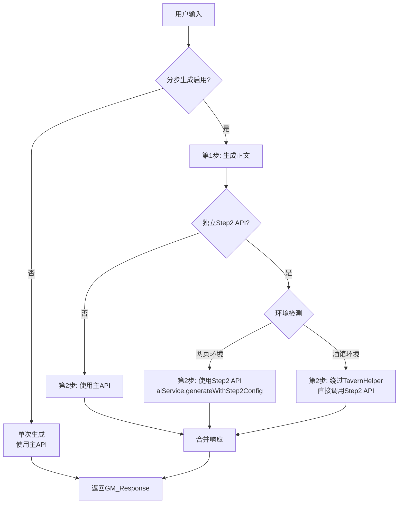

# 第二步独立API配置功能设计方案

## 需求概述

在酒馆（SillyTavern）和网页环境下，实现"分步生成"模式中**第二步**使用独立的API与模型配置，用于生成结构化数据（记忆/指令/行动选项）。

---

## 当前架构分析

### 分步生成流程

当前在 [`AIBidirectionalSystem.ts`](src/utils/AIBidirectionalSystem.ts:270-414) 中实现：

```
用户输入 → 第1步（生成正文text，可流式）→ 第2步（生成结构化数据，非流式）→ 返回完整响应
```

**问题**：两步使用相同的API配置，无法独立设置模型。

### 涉及的核心文件

| 文件 | 作用 |
|------|------|
| `src/services/aiService.ts` | AI服务核心，管理API配置和调用 |
| `src/utils/AIBidirectionalSystem.ts` | 分步生成逻辑实现 |
| `src/components/dashboard/SettingsPanel.vue` | 设置界面UI |
| `src/utils/tavern.ts` | 酒馆环境API包装器 |

---

## 技术设计方案

### 1. 扩展 AIConfig 接口

**文件**: `src/services/aiService.ts`

```typescript
export interface AIConfig {
  mode: 'tavern' | 'custom';
  streaming?: boolean;
  memorySummaryMode?: 'raw' | 'standard';
  initMode?: 'generate' | 'generateRaw';
  
  // 主API配置（用于第1步生成正文）
  customAPI?: {
    provider: APIProvider;
    url: string;
    apiKey: string;
    model: string;
    temperature?: number;
    maxTokens?: number;
  };
  
  // 🆕 第二步API配置（用于生成结构化数据）
  step2API?: {
    enabled: boolean;           // 是否启用独立配置
    provider: APIProvider;
    url: string;
    apiKey: string;
    model: string;
    temperature?: number;
    maxTokens?: number;
  };
}
```

### 2. 新增 Step2 生成方法

**文件**: `src/services/aiService.ts`

```typescript
class AIService {
  // 现有方法
  async generate(params) { ... }
  async generateRaw(params) { ... }
  
  // 🆕 新增：获取第二步API配置
  getStep2Config(): AIConfig['step2API'] | null {
    if (!this.config.step2API?.enabled) return null;
    return this.config.step2API;
  }
  
  // 🆕 新增：使用第二步配置调用API
  async generateWithStep2Config(params): Promise<string> {
    const step2Config = this.getStep2Config();
    if (!step2Config) {
      // 未启用，回退到主配置
      return this.generate(params);
    }
    
    // 使用step2Config构建独立请求
    return this._callProviderAPI(step2Config, params);
  }
}
```

### 3. 修改分步生成逻辑

**文件**: `src/utils/AIBidirectionalSystem.ts`

修改 `processPlayerAction` 方法中的分步生成部分：

```typescript
if (isSplitEnabled) {
  // 第1步：使用主API生成正文
  const step1Raw = await generateOnce({
    user_input: finalUserInput,
    should_stream: useStreaming,
    generation_id: `${generationId}_step1`,
    injects: injectsStep1,
    onStreamChunk: options?.onStreamChunk,
  });
  
  // ... 解析step1结果 ...
  
  // 🆕 第2步：检查是否使用独立API
  const step2Config = aiService.getStep2Config();
  
  if (step2Config && !tavernHelper) {
    // 网页环境 + 启用独立API：使用step2Config
    response = await aiService.generateWithStep2Config({
      user_input: step2UserInput,
      should_stream: false, // 第2步不流式
      generation_id: `${generationId}_step2`,
      injects: injectsStep2,
    });
  } else if (step2Config && tavernHelper) {
    // 酒馆环境 + 启用独立API：使用独立的API调用
    response = await callStep2WithIndependentAPI(step2Config, step2UserInput, injectsStep2);
  } else {
    // 未启用独立API：使用原有逻辑
    response = await generateOnce({
      user_input: step2UserInput,
      should_stream: false,
      generation_id: `${generationId}_step2`,
      injects: injectsStep2,
    });
  }
}
```

### 4. 设置界面UI设计

**文件**: `src/components/dashboard/SettingsPanel.vue`

在"分步生成"开关下方添加折叠面板：

```vue
<!-- 分步生成开关 -->
<div class="setting-item">
  <label>{{ t('分步生成') }}</label>
  <input type="checkbox" v-model="settings.splitResponseGeneration" />
</div>

<!-- 🆕 第二步API配置（条件显示） -->
<Transition name="fade">
  <div v-if="settings.splitResponseGeneration" class="step2-api-section">
    <div class="section-header">
      <h4>{{ t('第二步API配置') }}</h4>
      <span class="section-desc">{{ t('用于生成结构化数据（记忆/指令/行动选项）') }}</span>
    </div>
    
    <!-- 启用独立配置开关 -->
    <div class="setting-item">
      <label>{{ t('使用独立API') }}</label>
      <input type="checkbox" v-model="settings.step2API.enabled" />
    </div>
    
    <!-- 独立配置表单（条件显示） -->
    <Transition name="fade">
      <div v-if="settings.step2API.enabled" class="step2-api-form">
        <!-- 提供商选择 -->
        <select v-model="settings.step2API.provider">
          <option value="openai">OpenAI</option>
          <option value="claude">Claude</option>
          <option value="gemini">Gemini</option>
          <option value="deepseek">DeepSeek</option>
          <option value="custom">自定义</option>
        </select>
        
        <!-- API URL -->
        <input v-model="settings.step2API.url" placeholder="API URL" />
        
        <!-- API Key -->
        <input v-model="settings.step2API.apiKey" type="password" placeholder="API Key" />
        
        <!-- 模型名称 -->
        <input v-model="settings.step2API.model" placeholder="模型名称" />
        
        <!-- 温度 -->
        <input v-model.number="settings.step2API.temperature" type="number" step="0.1" />
        
        <!-- 最大Token -->
        <input v-model.number="settings.step2API.maxTokens" type="number" />
      </div>
    </Transition>
  </div>
</Transition>
```

### 5. 酒馆环境处理

**文件**: `src/utils/tavern.ts` 或新建辅助函数

酒馆环境下，第二步独立API需要**绕过酒馆的TavernHelper**，直接调用外部API：

```typescript
// 在AIBidirectionalSystem.ts中
async function callStep2WithIndependentAPI(
  step2Config: Step2APIConfig,
  userInput: string,
  injects: any[]
): Promise<string> {
  // 1. 将injects转换为messages格式
  const messages = convertInjectsToMessages(injects);
  messages.push({ role: 'user', content: userInput });
  
  // 2. 使用aiService的provider调用逻辑
  const { aiService } = await import('@/services/aiService');
  
  // 临时设置step2Config为主配置，调用后恢复
  const originalConfig = aiService.getConfig();
  aiService.configure({
    mode: 'custom',
    customAPI: {
      provider: step2Config.provider,
      url: step2Config.url,
      apiKey: step2Config.apiKey,
      model: step2Config.model,
      temperature: step2Config.temperature,
      maxTokens: step2Config.maxTokens,
    }
  });
  
  try {
    const response = await aiService.generateRaw({
      ordered_prompts: messages,
      should_stream: false, // 第2步不流式
      generation_id: `step2_${Date.now()}`,
    });
    return response;
  } finally {
    // 恢复原配置
    aiService.configure(originalConfig);
  }
}
```

---

## 数据流程图



---

## 配置存储方案

### localStorage 结构

```javascript
// 现有配置键
localStorage.getItem('ai-service-config')
// {
//   mode: 'custom',
//   streaming: true,
//   customAPI: { provider: 'openai', url: '...', apiKey: '...', model: 'gpt-4' }
// }

// 扩展后结构
localStorage.getItem('ai-service-config')
// {
//   mode: 'custom',
//   streaming: true,
//   customAPI: { ... },
//   step2API: {
//     enabled: true,
//     provider: 'deepseek',
//     url: 'https://api.deepseek.com/v1',
//     apiKey: 'sk-xxx',
//     model: 'deepseek-chat',
//     temperature: 0.3,
//     maxTokens: 2000
//   }
// }
```

---

## 实施步骤

### 阶段1: 核心接口扩展
1. 修改 `AIConfig` 接口，添加 `step2API` 字段
2. 在 `aiService.ts` 中添加 `getStep2Config()` 和 `generateWithStep2Config()` 方法
3. 更新配置读写逻辑

### 阶段2: 分步生成逻辑修改
4. 修改 `AIBidirectionalSystem.ts`，在分步生成第2步检测并使用独立API
5. 处理酒馆环境下的特殊情况

### 阶段3: 设置界面实现
6. 在 `SettingsPanel.vue` 添加第二步API配置区块
7. 实现配置表单的双向绑定和持久化

### 阶段4: 测试验证
8. 网页环境测试：验证独立API调用正常
9. 酒馆环境测试：验证绕过TavernHelper调用独立API

---

## 注意事项

1. **向后兼容**：未启用 `step2API.enabled` 时，保持原有行为
2. **错误处理**：Step2 API 调用失败时，可考虑回退到主API
3. **流式传输**：第2步通常不需要流式（生成结构化JSON），默认关闭
4. **API密钥安全**：step2API的密钥同样需要安全存储

---

## 预期效果

- 用户可以为第1步（生成正文）使用高质量模型如 GPT-4/Claude
- 第2步（生成结构化数据）可以使用成本较低但JSON输出稳定的模型如 DeepSeek
- 在酒馆环境下，第1步利用酒馆的角色卡/世界观预设，第2步使用独立API