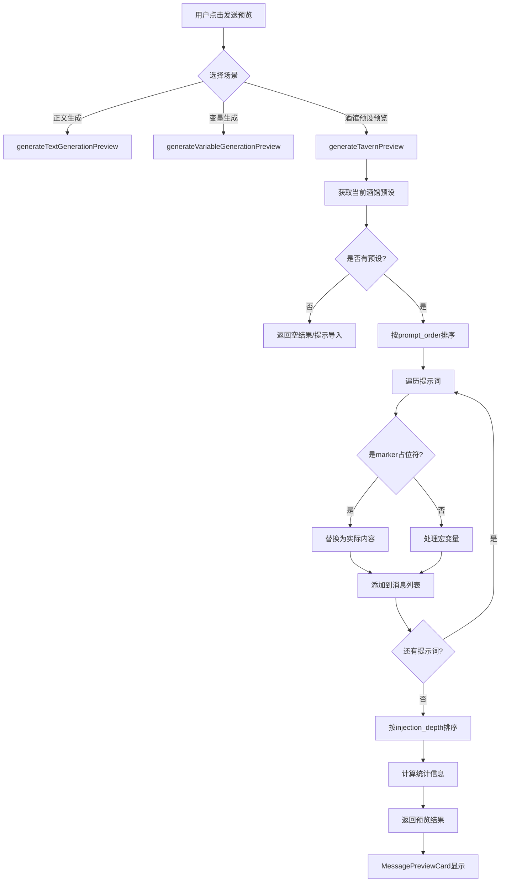
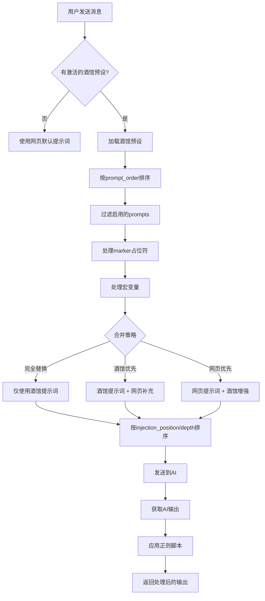
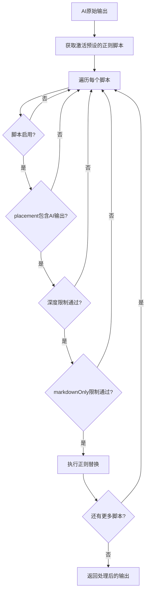

# 酒馆(SillyTavern)预设导入功能设计方案

## 1. 概述

### 1.1 目标

在网页端实现导入与酒馆(SillyTavern)兼容的提示词预设功能，使用户能够直接使用社区分享的预设文件（如【小猫之神】3.10.json）。

### 1.2 功能范围

- ✅ 完整支持正则脚本（regex_scripts）
- ✅ 完整支持宏变量系统（{{user}}, {{char}}, {{setvar}}, {{getvar}}等）
- ✅ 支持预设的prompt_order排序
- ✅ 支持marker占位符替换
- ✅ **集成到提示词管理面板**
- ✅ **支持发送预览功能**

### 1.3 酒馆预设格式分析

酒馆预设是一个复杂的JSON结构，包含以下核心部分：

```
TavernPreset
├── 模型参数（temperature, top_p, top_k等）
├── prompts[] - 提示词数组（核心）
│   ├── identifier - 唯一标识
│   ├── name - 显示名称
│   ├── enabled - 是否启用
│   ├── injection_position - 注入位置 (0=after system, 1=in-chat)
│   ├── injection_depth - 注入深度 (0=最后, 1=倒数第二...)
│   ├── role - 角色(system/user/assistant)
│   ├── content - 提示词内容
│   └── marker - 是否是占位标记
├── prompt_order[] - 提示词排序
├── extensions - 扩展配置
│   ├── SPreset - 特殊预设配置
│   │   ├── ChatSquash - 消息压缩配置
│   │   └── RegexBinding - 正则绑定
│   └── regex_scripts[] - 正则脚本
└── 其他配置项
```

## 2. UI集成设计

### 2.1 集成到提示词管理面板

**修改 [`PromptManagementPanel.vue`](src/components/dashboard/PromptManagementPanel.vue:191)**，新增"酒馆预设"标签页：

```typescript
// 标签页配置 - 新增酒馆预设
const tabs = [
  { key: 'prompts', label: '提示词', icon: '📝' },
  { key: 'preview', label: '发送预览', icon: '👁️' },
  { key: 'tavern', label: '酒馆预设', icon: '🍺' }, // 新增
  { key: 'worldbook', label: '世界书', icon: '📚' },
  { key: 'optimization', label: '正文优化', icon: '✨' },
  { key: 'memory', label: '记忆设置', icon: '🧠' },
]
```

```vue
<!-- 在 tabs-content 中新增 -->
<div v-else-if="activeTab === 'tavern'" class="tab-panel">
  <TavernPresetTab @preview-request="handleTavernPreviewRequest" />
</div>
```

### 2.2 酒馆预设标签页组件

**新建 `src/components/dashboard/prompt-management/TavernPresetTab.vue`**

```vue
<template>
  <div class="tavern-preset-tab">
    <!-- 顶部工具栏 -->
    <div class="tab-toolbar">
      <button class="toolbar-btn primary" @click="showImportModal = true">
        <svg>...</svg> 导入预设
      </button>
      <button class="toolbar-btn" @click="exportCurrentPreset" :disabled="!hasActivePreset">
        <svg>...</svg> 导出当前
      </button>
      <button class="toolbar-btn" @click="clearPreset" :disabled="!hasActivePreset">
        <svg>...</svg> 清除预设
      </button>
      <button class="toolbar-btn preview" @click="$emit('preview-request')">
        <svg>...</svg> 预览发送
      </button>
    </div>

    <!-- 当前预设状态卡片 -->
    <div class="preset-status-card" :class="{ active: hasActivePreset }">
      <div class="status-icon">{{ hasActivePreset ? '✅' : '📭' }}</div>
      <div class="status-info">
        <span class="status-title">{{ hasActivePreset ? activePresetName : '未加载预设' }}</span>
        <span class="status-desc">{{ statusDescription }}</span>
      </div>
      <div v-if="hasActivePreset" class="status-stats">
        <span class="stat">📝 {{ enabledPromptsCount }}/{{ totalPromptsCount }} 提示词</span>
        <span class="stat">🔧 {{ enabledRegexCount }}/{{ totalRegexCount }} 正则</span>
      </div>
    </div>

    <!-- 预设内容管理（仅当有预设时显示） -->
    <div v-if="hasActivePreset" class="preset-content">
      <!-- 提示词列表 -->
      <div class="section">
        <div class="section-header" @click="toggleSection('prompts')">
          <span>📝 提示词列表</span>
          <svg :class="{ expanded: expandedSections.prompts }">...</svg>
        </div>
        <div v-if="expandedSections.prompts" class="section-content">
          <div v-for="prompt in orderedPrompts" :key="prompt.identifier" class="prompt-item">
            <label class="prompt-toggle">
              <input type="checkbox" v-model="prompt.enabled" @change="updatePrompt(prompt)" />
              <span class="prompt-name">{{ prompt.name }}</span>
            </label>
            <span class="prompt-role">{{ prompt.role }}</span>
            <button class="edit-btn" @click="editPrompt(prompt)">编辑</button>
          </div>
        </div>
      </div>

      <!-- 正则脚本列表 -->
      <div class="section">
        <div class="section-header" @click="toggleSection('regex')">
          <span>🔧 正则脚本</span>
          <svg :class="{ expanded: expandedSections.regex }">...</svg>
        </div>
        <div v-if="expandedSections.regex" class="section-content">
          <div v-for="script in regexScripts" :key="script.id" class="regex-item">
            <label class="regex-toggle">
              <input type="checkbox" :checked="!script.disabled" @change="toggleRegex(script)" />
              <span class="regex-name">{{ script.scriptName }}</span>
            </label>
            <span class="regex-placement">{{ formatPlacement(script.placement) }}</span>
          </div>
        </div>
      </div>

      <!-- 模型参数 -->
      <div class="section">
        <div class="section-header" @click="toggleSection('params')">
          <span>⚙️ 模型参数</span>
          <svg :class="{ expanded: expandedSections.params }">...</svg>
        </div>
        <div v-if="expandedSections.params" class="section-content params-grid">
          <div class="param-item">
            <label>Temperature</label>
            <input type="number" v-model="modelParams.temperature" step="0.01" />
          </div>
          <div class="param-item">
            <label>Top P</label>
            <input type="number" v-model="modelParams.top_p" step="0.01" />
          </div>
          <!-- 更多参数... -->
        </div>
      </div>
    </div>

    <!-- 导入模态框 -->
    <TavernPresetImportModal
      v-if="showImportModal"
      @close="showImportModal = false"
      @imported="handleImported"
    />
  </div>
</template>
```

### 2.3 发送预览集成

**扩展 [`SendPreviewTab.vue`](src/components/dashboard/prompt-management/SendPreviewTab.vue:32)** 以支持酒馆预设预览：

```typescript
// 场景选择器新增选项
export type PreviewScenario =
  | 'text_generation'
  | 'variable_generation'
  | 'variable_reroll'
  | 'text_optimization'
  | 'text_optimization_reroll'
  | 'tavern_preview' // 新增

const scenarios = [
  { value: 'text_generation', label: '正文生成' },
  { value: 'variable_generation', label: '变量生成' },
  { value: 'variable_reroll', label: '变量再生成' },
  { value: 'text_optimization', label: '正文优化' },
  { value: 'text_optimization_reroll', label: '正文再优化' },
  { value: 'tavern_preview', label: '🍺 酒馆预设预览' }, // 新增
]
```

```vue
<!-- 酒馆预设预览选项（仅在选择酒馆预览时显示） -->
<div v-if="selectedScenario === 'tavern_preview'" class="tavern-preview-options">
  <div class="config-row">
    <label class="config-label">预设状态</label>
    <span :class="{ active: hasTavernPreset }">
      {{ hasTavernPreset ? currentPresetName : '未加载预设' }}
    </span>
    <button v-if="!hasTavernPreset" class="link-btn" @click="goToTavernTab">
      去导入预设 →
    </button>
  </div>

  <div v-if="hasTavernPreset" class="config-row">
    <label class="config-label">应用正则</label>
    <input type="checkbox" v-model="applyRegexScripts" />
    <span class="hint">预览时模拟正则脚本处理效果</span>
  </div>

  <div v-if="hasTavernPreset" class="config-row">
    <label class="config-label">显示宏变量</label>
    <select v-model="macroDisplayMode">
      <option value="processed">已处理（展示替换后结果）</option>
      <option value="raw">原始（展示宏变量标记）</option>
    </select>
  </div>
</div>
```

### 2.4 预览流程图



## 3. TypeScript 接口定义

### 3.1 酒馆预设接口 (新建 `src/types/tavernPreset.ts`)

```typescript
/**
 * 酒馆预设格式完整类型定义
 */

// 单个提示词项
export interface TavernPromptItem {
  identifier: string // 唯一标识符
  name: string // 显示名称
  enabled: boolean // 是否启用
  injection_position: number // 0=系统后, 1=消息中
  injection_depth: number // 注入深度（0=最后，越大越靠前）
  injection_order: number // 同深度时的排序
  role: 'system' | 'user' | 'assistant' // 角色
  content: string // 提示词内容
  system_prompt?: boolean // 是否是系统提示
  marker?: boolean // 是否是占位标记
  forbid_overrides?: boolean // 是否禁止覆盖
  injection_trigger?: string[] // 触发条件
}

// 提示词排序项
export interface TavernPromptOrderItem {
  identifier: string
  enabled: boolean
}

// 角色提示词顺序
export interface TavernPromptOrder {
  character_id: number // 100000=默认, 100001=特定角色
  order: TavernPromptOrderItem[]
}

// 正则脚本（强化版正则替换规则）
export interface TavernRegexScript {
  id: string
  scriptName: string
  findRegex: string // 正则表达式
  replaceString: string // 替换字符串
  trimStrings: string[] // 需要trim的字符串
  placement: number[] // 应用位置: 0=用户输入, 1=AI输出, 2=斜杠命令
  disabled: boolean // 是否禁用
  markdownOnly: boolean // 仅在Markdown渲染时应用
  promptOnly: boolean // 仅在发送Prompt时应用
  runOnEdit: boolean // 编辑消息时运行
  substituteRegex: number // 替换正则索引
  minDepth: number | null // 最小聊天深度
  maxDepth: number | null // 最大聊天深度
}

// SPreset扩展配置
export interface TavernSPresetConfig {
  ChatSquash?: {
    enabled: boolean
    role: string
    stop_string: string
    user_prefix: string
    user_suffix: string
    char_prefix: string
    char_suffix: string
    squashed_post_script_enable?: boolean
    squashed_post_script?: string
    enable_stop_string: boolean
  }
  RegexBinding?: {
    regexes: TavernRegexScript[]
  }
  MacroNest?: boolean
}

// 完整预设格式
export interface TavernPreset {
  // 模型参数
  temperature: number
  frequency_penalty: number
  presence_penalty: number
  top_p: number
  top_k: number
  top_a?: number
  min_p?: number
  repetition_penalty?: number
  openai_max_context: number
  openai_max_tokens: number

  // 提示词配置
  prompts: TavernPromptItem[]
  prompt_order: TavernPromptOrder[]

  // 格式配置
  wrap_in_quotes: boolean
  names_behavior: number
  send_if_empty: string
  impersonation_prompt: string
  new_chat_prompt: string
  continue_nudge_prompt: string

  // 功能开关
  max_context_unlocked: boolean
  stream_openai: boolean
  continue_prefill?: boolean
  show_thoughts?: boolean

  // 扩展
  extensions?: {
    SPreset?: TavernSPresetConfig
    regex_scripts?: TavernRegexScript[]
    [key: string]: any
  }
}

// 宏变量上下文
export interface MacroContext {
  user: string // {{user}} - 用户名
  char: string // {{char}} - 角色名
  lastUserMessage: string // {{lastUserMessage}}
  lastCharMessage?: string // {{lastCharMessage}}
  chatHistory?: any[] // 聊天历史
  variables: Record<string, string> // {{getvar::key}} / {{setvar::key::value}}
  // Marker替换内容
  worldInfoBefore?: string
  worldInfoAfter?: string
  personaDescription?: string
  charDescription?: string
  charPersonality?: string
  scenario?: string
  dialogueExamples?: string
}

// 导入后的本地预设格式
export interface LocalTavernPreset {
  id: string // 本地唯一ID
  name: string // 预设名称
  description?: string // 描述
  source: 'tavern' // 来源标识
  sourceFileName?: string // 源文件名
  importedAt: string // 导入时间
  enabled: boolean // 是否激活

  // 合并策略
  mergeMode: 'replace' | 'tavern-first' | 'web-first'

  // 原始配置
  modelParams: {
    temperature: number
    top_p: number
    top_k: number
    frequency_penalty: number
    presence_penalty: number
    max_context: number
    max_tokens: number
  }

  // 转换后的提示词
  prompts: TavernPromptItem[]
  promptOrder: TavernPromptOrderItem[]

  // 正则脚本
  regexScripts: TavernRegexScript[]

  // 原始数据（用于导出）
  rawData: TavernPreset
}
```

## 4. 宏变量系统设计

### 4.1 支持的宏变量

基于酒馆预设分析，需要支持以下宏变量：

| 宏变量                   | 描述             | 实现方式          |
| ------------------------ | ---------------- | ----------------- |
| `{{user}}`               | 用户名           | 从上下文获取      |
| `{{char}}`               | 角色名           | 从角色卡获取      |
| `{{lastUserMessage}}`    | 最后一条用户消息 | 从聊天历史获取    |
| `{{lastCharMessage}}`    | 最后一条角色消息 | 从聊天历史获取    |
| `{{random::a::b::c}}`    | 随机选择         | 随机返回a/b/c之一 |
| `{{getvar::key}}`        | 获取变量         | 从变量存储获取    |
| `{{setvar::key::value}}` | 设置变量         | 存储变量并返回空  |
| `{{//comment}}`          | 注释             | 直接移除          |
| `{{trim}}`               | 去除首尾空白     | 标记后处理        |

### 4.2 宏处理服务 (新建 `src/utils/tavernMacros.ts`)

```typescript
/**
 * 酒馆宏变量处理器
 */
export class TavernMacroProcessor {
  private variables: Map<string, string> = new Map()

  /**
   * 处理内容中的所有宏变量
   */
  process(content: string, context: MacroContext): string {
    let result = content

    // 处理注释 {{//...}}
    result = result.replace(/\{\{\/\/[^}]*\}\}/g, '')

    // 处理基础变量
    result = result.replace(/\{\{user\}\}/g, context.user)
    result = result.replace(/\{\{char\}\}/g, context.char)
    result = result.replace(/\{\{lastUserMessage\}\}/g, context.lastUserMessage || '')

    // 处理随机选择 {{random::a::b::c}}
    result = result.replace(/\{\{random::([^}]+)\}\}/g, (_, options) => {
      const choices = options.split('::')
      return choices[Math.floor(Math.random() * choices.length)]
    })

    // 处理setvar {{setvar::key::value}}
    result = result.replace(/\{\{setvar::([^:]+)::([^}]*)\}\}/g, (_, key, value) => {
      this.variables.set(key, value)
      context.variables[key] = value
      return ''
    })

    // 处理getvar {{getvar::key}}
    result = result.replace(/\{\{getvar::([^}]+)\}\}/g, (_, key) => {
      return this.variables.get(key) || context.variables[key] || ''
    })

    // 处理trim标记
    if (result.includes('{{trim}}')) {
      result = result.replace(/\{\{trim\}\}/g, '')
      result = result.trim()
    }

    return result
  }

  /**
   * 重置变量状态
   */
  reset(): void {
    this.variables.clear()
  }
}
```

## 5. 正则脚本执行引擎

### 5.1 与现有正则规则的关系

酒馆正则脚本是现有 `TextReplaceRule` 的超集，需要设计兼容层：

```typescript
/**
 * 正则脚本执行引擎 (新建 src/utils/tavernRegex.ts)
 */
export class TavernRegexEngine {
  /**
   * 对AI输出应用正则脚本
   */
  applyToOutput(
    output: string,
    scripts: TavernRegexScript[],
    options: {
      chatDepth?: number
      isMarkdownRender?: boolean
    } = {},
  ): string {
    let result = output

    for (const script of scripts) {
      if (script.disabled) continue
      if (!script.placement.includes(1)) continue // 1=AI输出

      // 检查深度限制
      if (options.chatDepth !== undefined) {
        if (script.minDepth !== null && options.chatDepth < script.minDepth) continue
        if (script.maxDepth !== null && options.chatDepth > script.maxDepth) continue
      }

      if (script.markdownOnly && !options.isMarkdownRender) continue

      try {
        const regexMatch = script.findRegex.match(/^\/(.+)\/([gimsuy]*)$/)
        if (regexMatch) {
          const [, pattern, flags] = regexMatch
          const regex = new RegExp(pattern, flags)
          result = result.replace(regex, script.replaceString)
        }
      } catch (e) {
        console.warn(`[TavernRegex] 执行失败: ${script.scriptName}`, e)
      }
    }

    return result
  }
}
```

## 6. 服务设计

### 6.1 酒馆预设服务 (新建 `src/services/tavernPresetService.ts`)

```typescript
import { openDB, IDBPDatabase, DBSchema } from 'idb'
import type {
  TavernPreset,
  LocalTavernPreset,
  TavernPromptItem,
  MacroContext,
} from '@/types/tavernPreset'
import { TavernMacroProcessor } from '@/utils/tavernMacros'
import { TavernRegexEngine } from '@/utils/tavernRegex'

interface TavernPresetDB extends DBSchema {
  tavernPresets: {
    key: string
    value: LocalTavernPreset
    indexes: { 'by-name': string; 'by-importedAt': string }
  }
  activePreset: {
    key: string
    value: { id: string }
  }
}

class TavernPresetService {
  private db: IDBPDatabase<TavernPresetDB> | null = null
  private macroProcessor = new TavernMacroProcessor()
  private regexEngine = new TavernRegexEngine()

  // 初始化数据库
  async init(): Promise<void>

  // 导入预设
  async importPreset(file: File, options?: { customName?: string }): Promise<LocalTavernPreset>

  // 验证预设格式
  validatePreset(data: any): { valid: boolean; errors: string[] }

  // CRUD
  async savePreset(preset: LocalTavernPreset): Promise<void>
  async getPreset(id: string): Promise<LocalTavernPreset | null>
  async getAllPresets(): Promise<LocalTavernPreset[]>
  async deletePreset(id: string): Promise<void>

  // 激活管理
  async setActivePreset(id: string): Promise<void>
  async getActivePreset(): Promise<LocalTavernPreset | null>
  async clearActivePreset(): Promise<void>

  /**
   * 构建发送给AI的消息列表（核心方法）
   */
  buildPromptMessages(
    preset: LocalTavernPreset,
    context: MacroContext,
    webPrompts?: AIMessage[],
  ): AIMessage[]

  /**
   * 对AI输出应用正则脚本
   */
  applyRegexScripts(
    output: string,
    preset: LocalTavernPreset,
    options?: { chatDepth?: number },
  ): string
}

export const tavernPresetService = new TavernPresetService()
```

### 6.2 扩展 promptPreviewService

**修改 [`promptPreviewService.ts`](src/services/promptPreviewService.ts:281)** 新增酒馆预设预览方法：

```typescript
/**
 * 生成酒馆预设预览
 */
public async generateTavernPreview(options?: PreviewOptions): Promise<PreviewResult> {
  const messages: PreviewMessage[] = [];
  const tavernPreset = await tavernPresetService.getActivePreset();

  if (!tavernPreset) {
    return {
      messages: [this.createMessage('system', '未加载酒馆预设，请先导入预设文件', '提示', 0)],
      totalCharCount: 0,
      estimatedTokens: 0
    };
  }

  // 1. 构建宏上下文
  const macroContext = this.buildMacroContext(options);

  // 2. 获取启用的提示词，按 prompt_order 排序
  const orderedPrompts = this.getOrderedPrompts(tavernPreset);

  // 3. 处理每个提示词
  for (const prompt of orderedPrompts) {
    if (!prompt.enabled) continue;

    // 处理 marker 类型（占位符）
    if (prompt.marker) {
      const markerContent = this.resolveMarker(prompt.identifier, macroContext);
      if (markerContent) {
        messages.push(this.createMessage(
          prompt.role,
          markerContent,
          `占位符: ${prompt.name}`,
          prompt.injection_depth
        ));
      }
      continue;
    }

    // 处理宏变量
    const macroProcessor = new TavernMacroProcessor();
    const processedContent = macroProcessor.process(prompt.content, macroContext);

    messages.push(this.createMessage(
      prompt.role,
      processedContent,
      `酒馆预设: ${prompt.name}`,
      prompt.injection_depth
    ));
  }

  // 4. 按 injection_depth 排序（降序，depth大的在前）
  messages.sort((a, b) => b.depth - a.depth);

  return this.calculateResult(messages);
}

private buildMacroContext(options?: PreviewOptions): MacroContext {
  const gameStateStore = useGameStateStore();
  const character = gameStateStore.character;

  return {
    user: character?.名称 || '修士',
    char: 'AI',
    lastUserMessage: options?.userInput || '',
    variables: {},
    charDescription: character?.背景故事 || '',
    scenario: '',
    // ... 其他上下文
  };
}

private resolveMarker(identifier: string, context: MacroContext): string | null {
  switch (identifier) {
    case 'charDescription':
      return context.charDescription || '';
    case 'worldInfoBefore':
    case 'worldInfoAfter':
      return this.getWorldBookContent();
    case 'chatHistory':
      return this.getChatHistoryContent();
    default:
      return null;
  }
}

private getOrderedPrompts(preset: LocalTavernPreset): TavernPromptItem[] {
  // 获取默认排序（character_id = 100001）
  const orderConfig = preset.promptOrder || [];
  const promptMap = new Map(preset.prompts.map(p => [p.identifier, p]));

  const ordered: TavernPromptItem[] = [];
  for (const item of orderConfig) {
    const prompt = promptMap.get(item.identifier);
    if (prompt) {
      // 使用排序配置中的enabled状态
      ordered.push({ ...prompt, enabled: item.enabled });
    }
  }

  return ordered;
}
```

## 7. 数据流设计

### 7.1 消息构建流程（核心）



### 7.2 正则脚本执行流程



### 7.3 存储结构

使用 IndexedDB 存储酒馆预设数据：

```
IndexedDB: XianTuDB
├── tavernPresets (预设存储)
│   ├── key: string (预设ID)
│   ├── value: LocalTavernPreset
│   └── indexes:
│       ├── by-name: string
│       └── by-importedAt: string
└── activePreset (当前激活)
    ├── key: "current"
    └── value: { id: string }
```

## 8. 需要创建/修改的文件

| 文件路径                                                                 | 类型 | 说明                          |
| ------------------------------------------------------------------------ | ---- | ----------------------------- |
| `src/types/tavernPreset.ts`                                              | 新建 | TypeScript类型定义            |
| `src/utils/tavernMacros.ts`                                              | 新建 | 宏变量处理器                  |
| `src/utils/tavernRegex.ts`                                               | 新建 | 正则脚本引擎                  |
| `src/services/tavernPresetService.ts`                                    | 新建 | 预设管理服务                  |
| `src/components/dashboard/prompt-management/TavernPresetTab.vue`         | 新建 | 酒馆预设标签页                |
| `src/components/dashboard/prompt-management/TavernPresetImportModal.vue` | 新建 | 导入模态框                    |
| `src/components/dashboard/PromptManagementPanel.vue`                     | 修改 | 添加酒馆预设标签页            |
| `src/services/promptPreviewService.ts`                                   | 修改 | 新增generateTavernPreview方法 |
| `src/components/dashboard/prompt-management/SendPreviewTab.vue`          | 修改 | 新增酒馆预设预览场景          |

## 9. 实现计划

### 阶段1：基础框架

1. 创建TypeScript类型定义 (`src/types/tavernPreset.ts`)
2. 实现TavernPresetService基础功能（IndexedDB存储）
3. 创建导入模态框组件

### 阶段2：核心功能

4. 实现宏变量处理器 (`TavernMacroProcessor`)
5. 实现正则脚本引擎 (`TavernRegexEngine`)
6. 实现消息构建逻辑（`buildPromptMessages`）

### 阶段3：UI集成

7. 在PromptManagementPanel添加"酒馆预设"标签页
8. 实现TavernPresetTab组件
9. 实现预设列表管理UI

### 阶段4：发送预览集成

10. 扩展promptPreviewService新增generateTavernPreview方法
11. 修改SendPreviewTab支持酒馆预设预览场景
12. 实现预览结果展示

### 阶段5：完善

13. 与现有正则规则系统的集成
14. 预设导出功能
15. 测试与优化

## 10. 待确认事项

在开始实现之前，请确认：

1. **标签页位置**：酒馆预设标签页放在"发送预览"之后是否合适？还是放在最后？
2. **预设数量限制**：是否需要限制导入的预设数量？
3. **正则脚本冲突处理**：当酒馆正则脚本与现有TextReplaceRule冲突时如何处理？
4. **模型参数应用**：导入预设的模型参数（temperature等）是否自动应用到当前设置？
