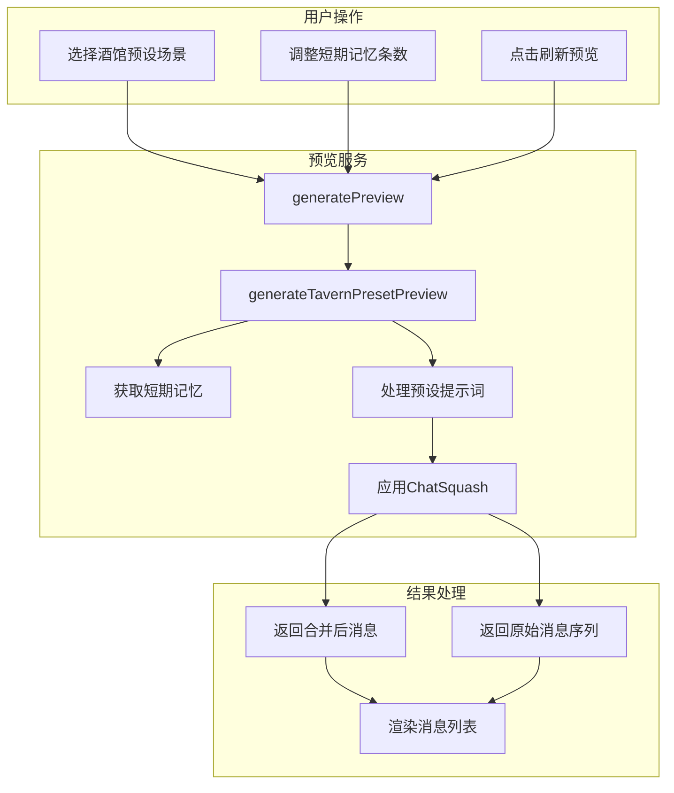
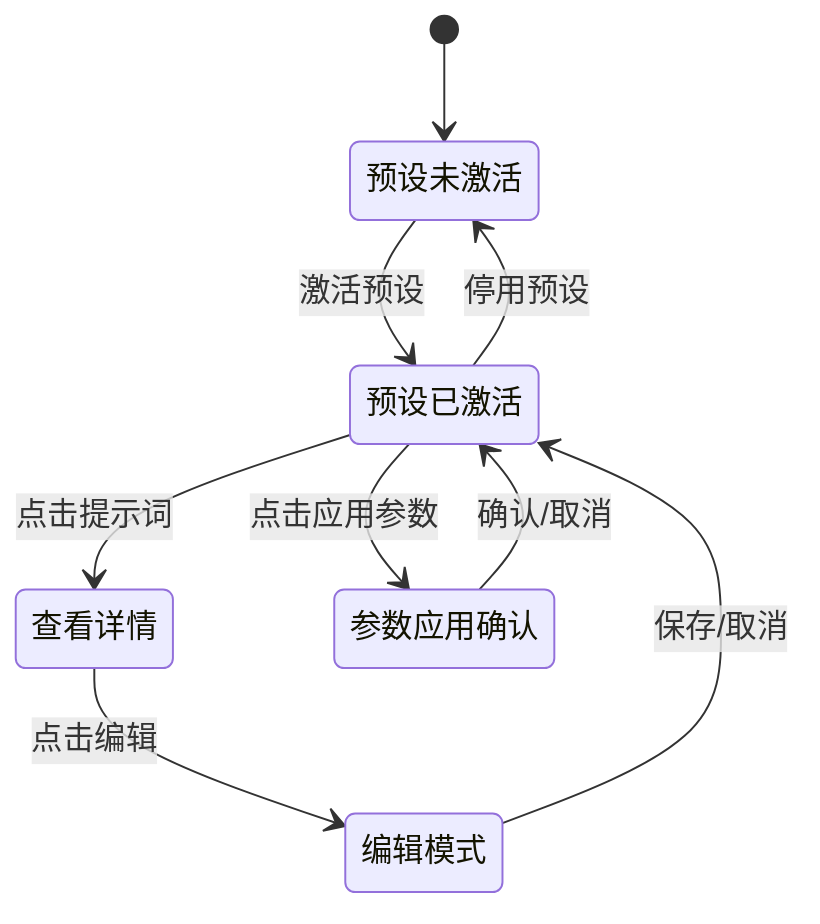

# 酒馆预设管理界面优化方案

## 问题概述

用户提出了5个需要优化的问题：

1. **发送预览里酒馆预设的短期记忆条数调整无效**
2. **记忆设置里没有酒馆预设的短期记忆条数设置**
3. **酒馆预设条目不能编辑**
4. **酒馆预设的模型参数应该要能够应用**
5. **发送预览里酒馆预设的全部消息序列都合在一起了，应该分开**

---

## 问题1 & 2：短期记忆条数问题

### 问题分析

**问题1** - [`SendPreviewTab.vue`](src/components/dashboard/prompt-management/SendPreviewTab.vue:154-168)：

- 预览生成时传递了 `shortTermMemoryCount`，但在 `generateTavernPresetPreview()` 方法中没有使用这个参数

**问题2** - [`MemoryPromptConfig.vue`](src/components/dashboard/prompt-management/MemoryPromptConfig.vue:8-69)：

- `ShortTermMemoryConfig` 接口只有5个场景的配置项，缺少 `tavernPresetCount`

**相关代码位置**：

- [`promptPreviewService.ts`](src/services/promptPreviewService.ts:38-45) - `ShortTermMemoryConfig` 接口定义
- [`promptPreviewService.ts`](src/services/promptPreviewService.ts:1200-1280) - `generateTavernPresetPreview()` 方法

### 解决方案

#### Step 1: 扩展 ShortTermMemoryConfig 接口

```typescript
// src/services/promptPreviewService.ts
export interface ShortTermMemoryConfig {
  textGenerationCount: number
  variableGenerationCount: number
  variableRerollCount: number
  textOptimizationCount: number
  textOptimizationRerollCount: number
  tavernPresetCount: number // 新增：酒馆预设场景
  promptTemplate: string
}
```

#### Step 2: 更新默认配置

```typescript
// promptPreviewService.ts - getDefaultConfig()
private getDefaultConfig(): ShortTermMemoryConfig {
  return {
    textGenerationCount: 3,
    variableGenerationCount: 3,
    variableRerollCount: 3,
    textOptimizationCount: 0,
    textOptimizationRerollCount: 0,
    tavernPresetCount: 3,  // 新增
    promptTemplate: DEFAULT_MEMORY_TEMPLATE,
  };
}
```

#### Step 3: 修改 generateTavernPresetPreview 方法

```typescript
// promptPreviewService.ts
private async generateTavernPresetPreview(
  options?: PreviewOptions
): Promise<PreviewResult> {
  // ... 现有代码 ...

  // 使用传入的短期记忆条数
  const memoryCount = options?.shortTermMemoryCount ?? this.memoryConfig.tavernPresetCount;
  const allMemories = this.getShortTermMemories();
  const memories = allMemories.slice(-memoryCount);

  // 生成记忆提示词
  if (memories.length > 0) {
    const memoryPrompt = this.generateMemoryPrompt(memories);
    // 将记忆注入到消息序列中...
  }
  // ...
}
```

#### Step 4: 更新 MemoryPromptConfig.vue

```vue
<!-- MemoryPromptConfig.vue -->
<div class="config-grid-6">
  <!-- 现有5个配置项 -->

  <!-- 新增：酒馆预设 -->
  <div class="config-item">
    <label>酒馆预设</label>
    <input
      type="number"
      v-model.number="config.tavernPresetCount"
      min="0"
      max="20"
      @change="saveConfig"
      class="number-input"
    />
    <span class="unit">条</span>
  </div>
</div>
```

#### Step 5: 更新 SendPreviewTab.vue 场景判断

```typescript
// SendPreviewTab.vue - getDefaultMemoryCount()
const getDefaultMemoryCount = (scenario: PreviewScenario): number => {
  const config = promptPreviewService.getMemoryConfig()
  switch (scenario) {
    // ... 现有cases ...
    case 'tavern_preset':
      return config.tavernPresetCount
    default:
      return 3
  }
}
```

---

## 问题3：酒馆预设条目不能编辑

### 问题分析

当前 [`TavernPresetTab.vue`](src/components/dashboard/prompt-management/TavernPresetTab.vue:120-138)：

- 点击提示词条目只能查看详情（只读模式）
- 没有编辑按钮和编辑功能
- `viewingPrompt` 模态框只显示内容，不支持修改

### 解决方案

#### Step 1: 创建 TavernPromptEditModal.vue 组件

```vue
<!-- src/components/dashboard/prompt-management/TavernPromptEditModal.vue -->
<template>
  <div class="modal-overlay" @click.self="$emit('close')">
    <div class="modal-container edit-modal">
      <div class="modal-header">
        <h3>✏️ 编辑提示词</h3>
        <button class="close-btn" @click="$emit('close')">×</button>
      </div>
      <div class="modal-body">
        <!-- 名称 -->
        <div class="form-group">
          <label>名称</label>
          <input v-model="form.name" type="text" class="form-input" />
        </div>

        <!-- 角色 -->
        <div class="form-group">
          <label>角色</label>
          <select v-model="form.role" class="form-select">
            <option value="system">System</option>
            <option value="user">User</option>
            <option value="assistant">Assistant</option>
          </select>
        </div>

        <!-- 启用状态 -->
        <div class="form-group">
          <label>状态</label>
          <label class="toggle">
            <input type="checkbox" v-model="form.enabled" />
            <span>{{ form.enabled ? '启用' : '禁用' }}</span>
          </label>
        </div>

        <!-- 注入配置 -->
        <div class="form-row">
          <div class="form-group half">
            <label>注入位置</label>
            <select v-model.number="form.injection_position" class="form-select">
              <option :value="0">消息之前</option>
              <option :value="1">消息之后</option>
            </select>
          </div>
          <div class="form-group half">
            <label>注入深度</label>
            <input v-model.number="form.injection_depth" type="number" min="0" class="form-input" />
          </div>
        </div>

        <!-- 内容 -->
        <div class="form-group">
          <label>内容</label>
          <textarea
            v-model="form.content"
            class="form-textarea"
            rows="12"
            placeholder="输入提示词内容..."
          ></textarea>
        </div>
      </div>
      <div class="modal-footer">
        <button class="action-btn cancel" @click="$emit('close')">取消</button>
        <button class="action-btn save" @click="handleSave">保存</button>
      </div>
    </div>
  </div>
</template>

<script setup lang="ts">
import { ref, watch } from 'vue'
import type { TavernPromptItem } from '@/types/tavernPreset'

const props = defineProps<{
  prompt: TavernPromptItem
}>()

const emit = defineEmits<{
  close: []
  save: [prompt: TavernPromptItem]
}>()

const form = ref<TavernPromptItem>({ ...props.prompt })

watch(
  () => props.prompt,
  (newVal) => {
    form.value = { ...newVal }
  },
  { immediate: true },
)

function handleSave() {
  emit('save', { ...form.value })
}
</script>
```

#### Step 2: 在 TavernPresetTab.vue 中添加编辑功能

```vue
<!-- TavernPresetTab.vue -->
<template>
  <!-- 提示词列表项添加编辑按钮 -->
  <div class="prompt-item" :class="{ disabled: !prompt.enabled, marker: prompt.marker }">
    <!-- 现有内容 -->
    <span class="prompt-order">{{ idx + 1 }}</span>
    <span class="prompt-status">{{ prompt.enabled ? '✓' : '✗' }}</span>
    <span class="prompt-name">{{ prompt.name }}</span>
    <!-- ... -->

    <!-- 新增操作按钮 -->
    <div class="prompt-actions">
      <button class="icon-btn edit" title="编辑" @click.stop="editPrompt(prompt)">✏️</button>
      <button class="icon-btn view" title="查看" @click.stop="viewPromptDetail(prompt)">👁️</button>
    </div>
  </div>

  <!-- 编辑模态框 -->
  <TavernPromptEditModal
    v-if="editingPrompt"
    :prompt="editingPrompt"
    @close="editingPrompt = null"
    @save="handlePromptSave"
  />
</template>

<script setup lang="ts">
import TavernPromptEditModal from './TavernPromptEditModal.vue'

const editingPrompt = ref<TavernPromptItem | null>(null)

function editPrompt(prompt: TavernPromptItem) {
  editingPrompt.value = prompt
}

async function handlePromptSave(updatedPrompt: TavernPromptItem) {
  if (!activePreset.value) return

  // 更新预设中的提示词
  const updatedPrompts = activePreset.value.orderedPrompts.map((p) =>
    p.identifier === updatedPrompt.identifier ? updatedPrompt : p,
  )

  // 保存到数据库
  await tavernPresetService.updatePresetPrompts(activePreset.value.id, updatedPrompts)

  // 刷新列表
  editingPrompt.value = null
  await refreshPresets()
}
</script>
```

#### Step 3: 在 tavernPresetService 中添加更新方法

```typescript
// src/services/tavernPresetService.ts
export class TavernPresetService {
  // 更新预设的提示词列表
  async updatePresetPrompts(presetId: string, prompts: TavernPromptItem[]): Promise<void> {
    const preset = await this.getPresetById(presetId)
    if (!preset) throw new Error('Preset not found')

    preset.orderedPrompts = prompts
    preset.stats.totalPrompts = prompts.length
    preset.stats.enabledPrompts = prompts.filter((p) => p.enabled).length

    await this.savePreset(preset)
  }

  // 更新单个提示词
  async updatePrompt(presetId: string, prompt: TavernPromptItem): Promise<void> {
    const preset = await this.getPresetById(presetId)
    if (!preset) throw new Error('Preset not found')

    const index = preset.orderedPrompts.findIndex((p) => p.identifier === prompt.identifier)
    if (index === -1) throw new Error('Prompt not found')

    preset.orderedPrompts[index] = prompt
    preset.stats.enabledPrompts = preset.orderedPrompts.filter((p) => p.enabled).length

    await this.savePreset(preset)
  }
}
```

---

## 问题4：酒馆预设模型参数应用

### 问题分析

当前 [`TavernPresetTab.vue`](src/components/dashboard/prompt-management/TavernPresetTab.vue:169-203)：

- 模型参数区块标题为"⚙️ 模型参数（仅供参考）"
- 只是展示参数值，没有应用功能
- 预设中的 `modelParams` 存储了完整参数但未使用

### 解决方案

#### Step 1: 添加"应用参数"按钮

```vue
<!-- TavernPresetTab.vue -->
<div v-if="activePreset.rawData" class="detail-section">
  <div class="section-header" @click="showParams = !showParams">
    <h4>⚙️ 模型参数</h4>
    <div class="header-actions">
      <button
        class="apply-btn"
        @click.stop="applyModelParams"
        title="将这些参数应用到当前API设置"
      >
        应用参数
      </button>
      <span class="toggle-icon">{{ showParams ? '▼' : '▶' }}</span>
    </div>
  </div>
  <!-- 参数网格 -->
</div>
```

#### Step 2: 实现参数应用逻辑

```typescript
// TavernPresetTab.vue
import { useUIStore } from '@/stores/uiStore'

const uiStore = useUIStore()

async function applyModelParams() {
  if (!activePreset.value?.modelParams) return

  const params = activePreset.value.modelParams

  // 确认对话框
  const confirmed = await confirm(
    `确定要将预设"${activePreset.value.name}"的模型参数应用到当前设置吗？\n\n` +
      `Temperature: ${params.temperature}\n` +
      `Top P: ${params.top_p}\n` +
      `Max Tokens: ${params.max_tokens}`,
  )

  if (!confirmed) return

  // 应用到 uiStore 的 API 配置
  uiStore.setAPIConfig({
    temperature: params.temperature,
    top_p: params.top_p,
    top_k: params.top_k,
    frequency_penalty: params.frequency_penalty,
    presence_penalty: params.presence_penalty,
    max_tokens: params.max_tokens,
  })

  toast.success('模型参数已应用')
}
```

#### Step 3: 扩展 uiStore 支持参数批量更新

```typescript
// src/stores/uiStore.ts
export const useUIStore = defineStore('ui', {
  state: () => ({
    apiConfig: {
      temperature: 1.0,
      top_p: 1.0,
      top_k: 0,
      frequency_penalty: 0,
      presence_penalty: 0,
      max_tokens: 4096,
      // ...
    },
  }),

  actions: {
    setAPIConfig(params: Partial<typeof this.apiConfig>) {
      Object.assign(this.apiConfig, params)
      this.saveConfig()
    },
  },
})
```

---

## 问题5：消息序列分开显示

### 问题分析

当前 [`generateChatSquashPreview()`](src/services/promptPreviewService.ts:1250-1320)：

- ChatSquash 模式将所有消息合并为单条
- 返回的 `PreviewResult.messages` 只有1条合并后的消息
- 无法查看合并前的各个独立消息

### 解决方案

#### Step 1: 扩展 PreviewResult 类型

```typescript
// src/services/promptPreviewService.ts
export interface PreviewResult {
  messages: PreviewMessage[]
  totalCharCount: number
  estimatedTokens: number

  // 新增：合并前的原始消息（用于酒馆预设场景）
  preMergeMessages?: PreviewMessage[]
  // 新增：是否使用了 ChatSquash
  isChatSquashed?: boolean
}
```

#### Step 2: 修改 generateTavernPresetPreview 返回数据

```typescript
// promptPreviewService.ts
private async generateTavernPresetPreview(options?: PreviewOptions): Promise<PreviewResult> {
  // ... 现有代码生成消息序列 ...
  const rawMessages: PreviewMessage[] = [/* 合并前的消息列表 */];

  // 如果启用了 ChatSquash
  if (chatSquashConfig?.enabled) {
    const squashedMessage = this.applyChatSquash(rawMessages, chatSquashConfig);

    return {
      messages: [squashedMessage],  // 合并后的单条消息
      preMergeMessages: rawMessages, // 保留原始消息序列
      isChatSquashed: true,
      totalCharCount: squashedMessage.fullContent?.length ?? 0,
      estimatedTokens: Math.ceil((squashedMessage.fullContent?.length ?? 0) / 3),
    };
  }

  // 未启用 ChatSquash，正常返回
  return {
    messages: rawMessages,
    isChatSquashed: false,
    totalCharCount: /* ... */,
    estimatedTokens: /* ... */,
  };
}
```

#### Step 3: 在 SendPreviewTab.vue 添加切换显示模式

```vue
<!-- SendPreviewTab.vue -->
<template>
  <!-- 消息列表头部 -->
  <div class="messages-header">
    <span class="messages-title">消息序列 ({{ displayMessages.length }})</span>

    <!-- 新增：显示模式切换（仅酒馆预设场景显示） -->
    <div v-if="previewResult.isChatSquashed" class="display-mode-toggle">
      <button :class="{ active: displayMode === 'merged' }" @click="displayMode = 'merged'">
        合并视图
      </button>
      <button :class="{ active: displayMode === 'separate' }" @click="displayMode = 'separate'">
        分离视图 ({{ previewResult.preMergeMessages?.length || 0 }})
      </button>
    </div>

    <span class="messages-hint">按发送顺序排列</span>
  </div>

  <!-- 消息列表 -->
  <div class="messages-list">
    <MessagePreviewCard
      v-for="message in displayMessages"
      :key="message.id"
      :message="message"
      @copy="handleCopy"
    />
  </div>
</template>

<script setup lang="ts">
const displayMode = ref<'merged' | 'separate'>('merged')

const displayMessages = computed(() => {
  if (displayMode.value === 'separate' && previewResult.value.preMergeMessages) {
    return previewResult.value.preMergeMessages
  }
  return previewResult.value.messages
})
</script>

<style scoped>
.display-mode-toggle {
  display: flex;
  gap: 4px;
  background: rgba(0, 0, 0, 0.2);
  border-radius: 6px;
  padding: 2px;
}

.display-mode-toggle button {
  padding: 4px 10px;
  border: none;
  border-radius: 4px;
  background: transparent;
  color: rgba(255, 255, 255, 0.6);
  font-size: 11px;
  cursor: pointer;
  transition: all 0.2s;
}

.display-mode-toggle button.active {
  background: rgba(74, 158, 255, 0.3);
  color: #4a9eff;
}

.display-mode-toggle button:hover:not(.active) {
  background: rgba(255, 255, 255, 0.1);
}
</style>
```

---

## 实施计划

### 阶段1：短期记忆问题修复

| 任务                                                | 文件                      | 修改类型 |
| --------------------------------------------------- | ------------------------- | -------- |
| 扩展 ShortTermMemoryConfig 接口                     | `promptPreviewService.ts` | 修改     |
| 更新默认配置和本地存储键                            | `promptPreviewService.ts` | 修改     |
| 修改 generateTavernPresetPreview 使用传入的记忆条数 | `promptPreviewService.ts` | 修改     |
| 添加酒馆预设记忆条数配置项                          | `MemoryPromptConfig.vue`  | 修改     |
| 更新场景默认记忆条数获取                            | `SendPreviewTab.vue`      | 修改     |

### 阶段2：提示词编辑功能

| 任务                                | 文件                        | 修改类型 |
| ----------------------------------- | --------------------------- | -------- |
| 创建 TavernPromptEditModal 组件     | `TavernPromptEditModal.vue` | 新建     |
| 在 tavernPresetService 添加更新方法 | `tavernPresetService.ts`    | 修改     |
| 集成编辑功能到 TavernPresetTab      | `TavernPresetTab.vue`       | 修改     |

### 阶段3：模型参数应用

| 任务                              | 文件                  | 修改类型 |
| --------------------------------- | --------------------- | -------- |
| 在 uiStore 添加 setAPIConfig 方法 | `uiStore.ts`          | 修改     |
| 添加应用参数按钮和逻辑            | `TavernPresetTab.vue` | 修改     |
| 添加确认对话框样式                | `TavernPresetTab.vue` | 修改     |

### 阶段4：消息分离显示

| 任务                              | 文件                      | 修改类型 |
| --------------------------------- | ------------------------- | -------- |
| 扩展 PreviewResult 类型           | `promptPreviewService.ts` | 修改     |
| 修改预览生成返回 preMergeMessages | `promptPreviewService.ts` | 修改     |
| 添加显示模式切换UI                | `SendPreviewTab.vue`      | 修改     |
| 添加切换按钮样式                  | `SendPreviewTab.vue`      | 修改     |

---

## 技术要点

### 数据流程图



### 状态管理



---

## 验收标准

1. **短期记忆条数**
   - [ ] 发送预览中调整条数后刷新，消息内容随之变化
   - [ ] 记忆设置界面显示"酒馆预设"配置项
   - [ ] 默认值保存在本地存储并正确加载

2. **提示词编辑**
   - [ ] 点击编辑按钮弹出编辑模态框
   - [ ] 可修改名称、角色、启用状态、注入配置、内容
   - [ ] 保存后列表立即更新

3. **模型参数应用**
   - [ ] 参数区块显示"应用参数"按钮
   - [ ] 点击后显示确认对话框
   - [ ] 确认后参数同步到API设置

4. **消息分离显示**
   - [ ] 酒馆预设场景显示"合并视图/分离视图"切换按钮
   - [ ] 分离视图显示所有原始消息
   - [ ] 合并视图显示单条ChatSquash后的消息
