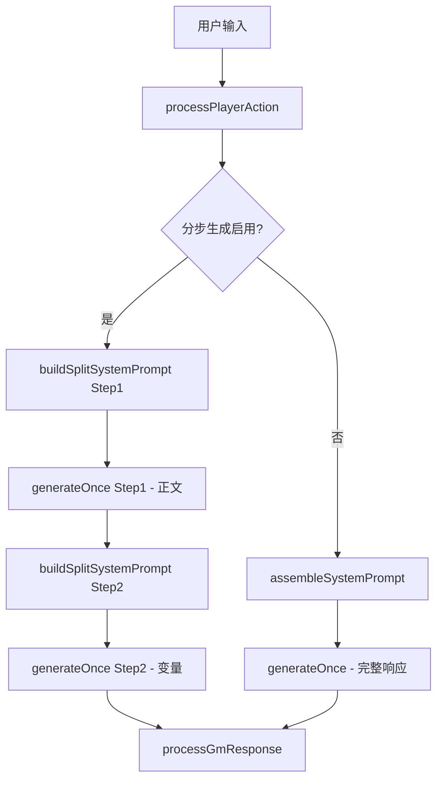
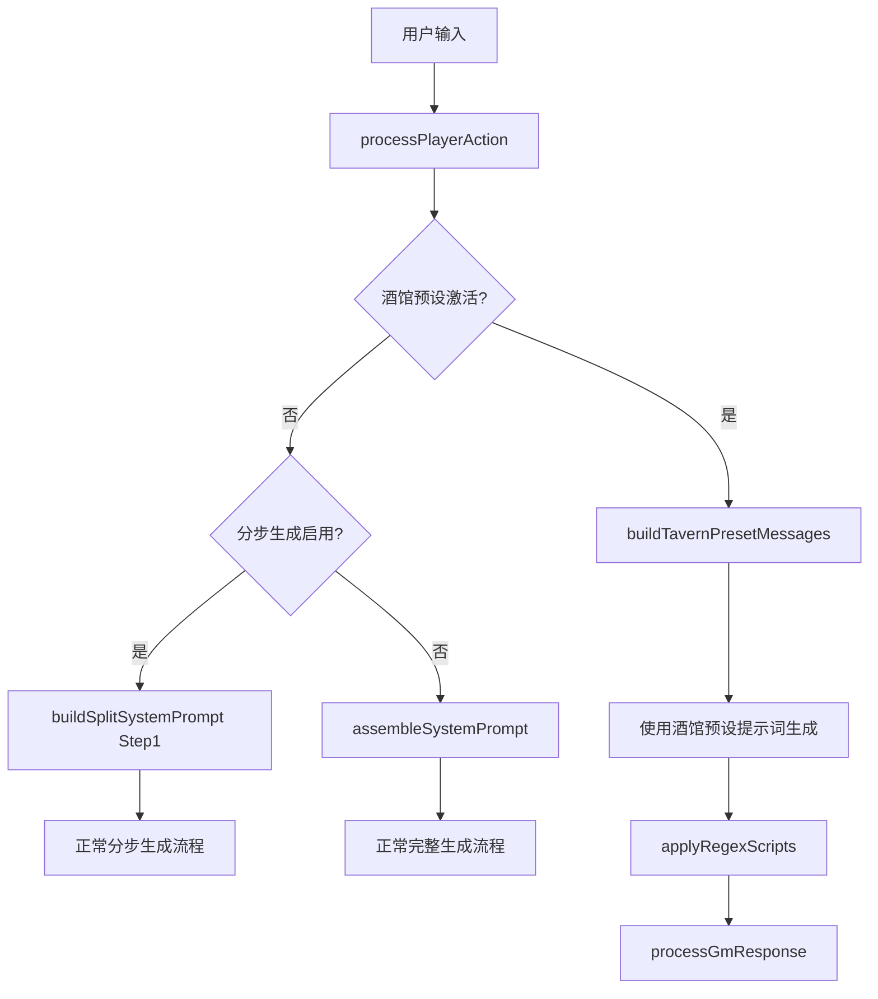
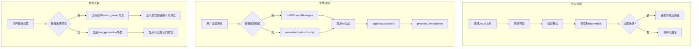

# 酒馆预设简化计划

## 需求概述

用户请求：

> "别弄那么多花里胡哨的酒馆预设导入模式了，只要启用的酒馆预设，就用酒馆预设来代替发送生成正文，原来的正文生成预览自动停用"

核心目标：

1. **移除合并模式选择** - 不再需要 `replace`、`tavern-first`、`web-first` 三种模式
2. **酒馆预设优先** - 当有激活的酒馆预设时，完全使用它来生成正文
3. **自动切换预览** - 预览界面根据酒馆预设状态自动调整显示

## 现有架构分析

### 关键文件

| 文件                                                                                                    | 作用         | 需要修改                      |
| ------------------------------------------------------------------------------------------------------- | ------------ | ----------------------------- |
| [`AIBidirectionalSystem.ts`](src/utils/AIBidirectionalSystem.ts)                                        | 核心生成逻辑 | ✅ 需要添加酒馆预设检测和替换 |
| [`tavernPresetService.ts`](src/services/tavernPresetService.ts)                                         | 预设管理服务 | ✅ 移除 mergeMode 逻辑        |
| [`TavernPresetImportModal.vue`](src/components/dashboard/prompt-management/TavernPresetImportModal.vue) | 导入对话框   | ✅ 移除合并策略选择           |
| [`TavernPresetTab.vue`](src/components/dashboard/prompt-management/TavernPresetTab.vue)                 | 预设列表显示 | ✅ 移除 mergeMode 显示        |
| [`SendPreviewTab.vue`](src/components/dashboard/prompt-management/SendPreviewTab.vue)                   | 发送预览     | ✅ 根据酒馆预设状态调整       |
| [`tavernPreset.ts`](src/types/tavernPreset.ts)                                                          | 类型定义     | ✅ 移除 mergeMode 相关类型    |

### 当前生成流程



### 期望的新流程



## 详细实施步骤

### 步骤 1: 修改 AIBidirectionalSystem.ts

**位置**: [`processPlayerAction()`](src/utils/AIBidirectionalSystem.ts:91) 方法开头

**修改内容**:
在构建提示词之前，检测是否有激活的酒馆预设。如果有，则使用酒馆预设的消息构建流程。

```typescript
// 在 processPlayerAction 方法中，约第 186 行之前添加

// 🔥 检查是否有激活的酒馆预设
const activePreset = await tavernPresetService.getActivePreset()
if (activePreset) {
  console.log('[AI双向系统] 检测到激活的酒馆预设:', activePreset.name)

  // 构建宏上下文
  const macroContext = tavernPresetService.createMacroContext({
    user: character.名字 || '修仙者',
    char: 'GM',
    lastUserMessage: userActionForAI,
    variables: {},
    // 根据游戏状态填充其他上下文...
  })

  // 使用酒馆预设构建消息
  const presetMessages = tavernPresetService.buildPromptMessages(activePreset, macroContext)

  // 将消息转换为 injects 格式
  const injects = presetMessages.map((msg, index) => ({
    content: msg.content,
    role: msg.role as 'system' | 'user' | 'assistant',
    depth: msg.depth ?? presetMessages.length - index,
    position: 'in_chat' as const,
  }))

  // ... 继续生成流程
}
```

### 步骤 2: 修改 tavernPresetService.ts

**修改 1**: 移除 [`convertToLocalPreset()`](src/services/tavernPresetService.ts:254) 中的 mergeMode

```typescript
// 第 335 行，移除 mergeMode 字段
return {
  id,
  name,
  description: rawData.extensions?.presetdetailnfo?.updateNote,
  source: 'tavern',
  sourceFileName: options.fileName,
  importedAt: new Date().toISOString(),
  enabled: false,

  // 🔥 移除这一行：
  // mergeMode: options.mergeMode || 'tavern-first',

  modelParams: { ... },
  // ...其他字段
}
```

**修改 2**: 简化 [`buildPromptMessages()`](src/services/tavernPresetService.ts:478) 方法签名

```typescript
// 移除 _webPrompts 参数（不再需要合并逻辑）
buildPromptMessages(
  preset: LocalTavernPreset,
  context: MacroContext
): Array<{ role: string; content: string; source?: string; depth?: number }>
```

### 步骤 3: 修改 TavernPresetImportModal.vue

**修改 1**: 移除合并策略选择 UI（第 141-148 行）

```vue
<!-- 删除整个合并策略选项 -->
<!-- <div class="option-row">
  <label>合并策略：</label>
  <select v-model="mergeMode">
    <option value="replace">完全替换（仅使用酒馆预设）</option>
    <option value="tavern-first">酒馆优先（推荐）</option>
    <option value="web-first">网页优先</option>
  </select>
</div> -->
```

**修改 2**: 移除 mergeMode 响应式变量（第 205 行）

```typescript
// 删除这行：
// const mergeMode = ref<'replace' | 'tavern-first' | 'web-first'>('tavern-first');
```

**修改 3**: 修改导入调用（第 320-327 行）

```typescript
const preset = await tavernPresetService.importPresetFromJSON(JSON.stringify(previewData.value), {
  fileName: fileName.value,
  customName: customName.value || undefined,
  // 🔥 移除 mergeMode
  activateImmediately: activateImmediately.value,
})
```

### 步骤 4: 修改 TavernPresetTab.vue

**修改 1**: 移除预设卡片中的合并模式显示（第 88-92 行）

```vue
<!-- 删除合并模式徽章 -->
<!-- <span class="merge-badge" :class="preset.mergeMode">
  {{ getMergeLabel(preset.mergeMode) }}
</span> -->
```

**修改 2**: 移除详情模态框中的合并模式显示（第 279-281 行）

```vue
<!-- 删除合并模式信息行 -->
<!-- <div class="info-row">
  <span class="info-label">合并模式</span>
  <span class="info-value">{{ getMergeLabel(selectedPreset?.mergeMode) }}</span>
</div> -->
```

**修改 3**: 移除 `getMergeLabel()` 函数（第 805-812 行）

```typescript
// 删除整个函数
// const getMergeLabel = (mode?: string): string => { ... }
```

### 步骤 5: 修改 SendPreviewTab.vue

**添加酒馆预设状态检测和自动切换**:

```typescript
// 在 script setup 中添加
import { tavernPresetService } from '@/services/tavernPresetService'

// 添加响应式变量
const hasActivePreset = ref(false)
const activePresetName = ref('')

// 检查酒馆预设状态
const checkActivePreset = async () => {
  const preset = await tavernPresetService.getActivePreset()
  hasActivePreset.value = !!preset
  activePresetName.value = preset?.name || ''

  // 如果有激活的预设，自动切换到酒馆预设场景
  if (preset && selectedScenario.value === 'text_generation') {
    selectedScenario.value = 'tavern_preset'
  }
}

// 在 onMounted 中调用
onMounted(() => {
  checkActivePreset()
  // ...其他初始化代码
})
```

**添加提示 UI**:

```vue
<!-- 在场景选择器下方添加提示 -->
<div v-if="hasActivePreset" class="preset-active-notice">
  <svg viewBox="0 0 24 24" width="14" height="14">
    <path fill="currentColor" d="M12 2C6.48 2 2 6.48 2 12s4.48 10 10 10 10-4.48 10-10S17.52 2 12 2zm1 15h-2v-6h2v6zm0-8h-2V7h2v2z"/>
  </svg>
  <span>
    已启用酒馆预设「{{ activePresetName }}」- 
    正文生成将使用酒馆预设提示词
  </span>
</div>
```

### 步骤 6: 更新类型定义 tavernPreset.ts

**修改 1**: 从 [`LocalTavernPreset`](src/types/tavernPreset.ts:212) 接口移除 mergeMode

```typescript
// 第 222 行，删除这一行：
// mergeMode: 'replace' | 'tavern-first' | 'web-first'
```

**修改 2**: 从 [`TavernPresetImportOptions`](src/types/tavernPreset.ts:256) 接口移除 mergeMode

```typescript
// 第 258 行，删除这一行：
// mergeMode?: 'replace' | 'tavern-first' | 'web-first'
```

## 流程图：简化后的架构



## 影响范围

### 需要修改的文件

1. `src/utils/AIBidirectionalSystem.ts` - 核心生成逻辑
2. `src/services/tavernPresetService.ts` - 预设服务
3. `src/components/dashboard/prompt-management/TavernPresetImportModal.vue` - 导入UI
4. `src/components/dashboard/prompt-management/TavernPresetTab.vue` - 列表显示
5. `src/components/dashboard/prompt-management/SendPreviewTab.vue` - 预览切换
6. `src/types/tavernPreset.ts` - 类型定义

### 不需要修改的文件

- `src/utils/tavernMacros.ts` - 宏处理器（保持不变）
- `src/utils/tavernRegex.ts` - 正则引擎（保持不变）
- `src/services/promptPreviewService.ts` - 预览服务（可能需要小调整以配合）

## 数据迁移

对于已导入的预设，`mergeMode` 字段将被忽略。不需要执行数据迁移，因为：

1. IndexedDB 中的旧数据仍然有效
2. 代码将不再读取或使用 `mergeMode` 字段
3. 所有预设都将按照"完全替换"模式工作

## 测试要点

1. **导入测试**: 确认新导入的预设不再包含 mergeMode 字段
2. **激活测试**: 确认激活预设后，生成流程使用酒馆预设的提示词
3. **预览测试**: 确认预览界面正确检测酒馆预设状态并自动切换
4. **兼容性测试**: 确认旧预设（包含 mergeMode）仍能正常使用
5. **停用测试**: 确认停用预设后，恢复使用标准生成流程

## 建议

完成上述修改后，建议在用户界面中添加一个明显的提示，告知用户当前的生成模式：

- 当酒馆预设激活时：显示「🍺 使用酒馆预设：XXX」
- 当未激活时：显示「📝 使用标准生成模式」

这样用户可以清楚地知道当前的生成行为。
