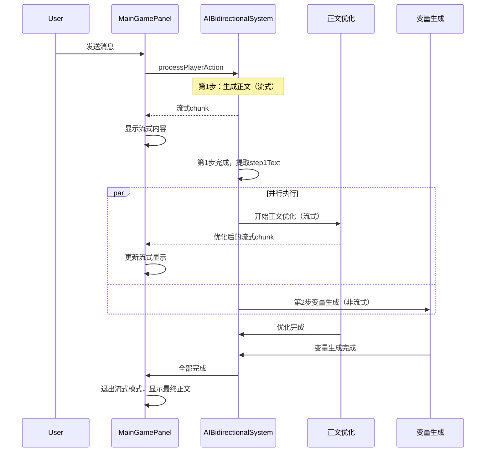

# 正文优化功能实施计划

## 1. 功能概述

### 1.1 需求分析

1. **设置界面重构**：
   - 将现有分散的API配置改为统一入口
   - 创建子页面分别设置三个API：正文API、变量API、正文优化API

2. **正文优化功能**：
   - 正文生成完成后立即开始
   - 与第二步变量生成并行执行
   - 正文优化使用流式传输
   - 正文优化完成后才退出流式UI模式

3. **正文优化提示词管理**：
   - 入口位于设置中"正则替换规则"下方
   - 支持导入/导出类似酒馆世界书格式的预设
   - 可独立编辑每个条目

### 1.2 流程图



## 2. 数据结构设计

### 2.1 正文优化API配置

```typescript
// src/services/aiService.ts

export interface TextOptimizationAPIConfig {
  /** 是否启用正文优化 */
  enabled: boolean
  /** API提供商 */
  provider: APIProvider
  /** API端点URL */
  url: string
  /** API密钥 */
  apiKey: string
  /** 模型名称 */
  model: string
  /** 温度参数 */
  temperature?: number
  /** 最大Token数 */
  maxTokens?: number
}

export interface AIConfig {
  mode: 'tavern' | 'custom'
  streaming?: boolean
  // ... 现有字段 ...

  /** 正文生成API配置（原customAPI） */
  textAPI?: CustomAPIConfig

  /** 变量生成API配置（原step2API） */
  variableAPI?: Step2APIConfig

  /** 正文优化API配置 */
  textOptimizationAPI?: TextOptimizationAPIConfig
}
```

### 2.2 正文优化提示词条目

```typescript
// src/types/textOptimization.ts

export interface TextOptimizationEntry {
  /** 唯一ID */
  id: string
  /** 条目名称 */
  name: string
  /** 提示词内容 */
  content: string
  /** 角色类型 */
  role: 'system' | 'user' | 'assistant'
  /** 是否启用 */
  enabled: boolean
  /** 注入深度 */
  depth: number
  /** 触发模式 */
  triggerMode?: 'blue' | 'green' | 'red'
  /** 关键词触发（可选） */
  keywords?: string[]
}

export interface TextOptimizationPreset {
  /** 预设ID */
  id: string
  /** 预设名称 */
  name: string
  /** 条目列表 */
  entries: TextOptimizationEntry[]
  /** 创建时间 */
  createdAt?: string
  /** 更新时间 */
  updatedAt?: string
}
```

### 2.3 UI状态扩展

```typescript
// src/stores/uiStore.ts 扩展

// 正文优化状态
const textOptimizationInProgress = ref(false)
const textOptimizationText = ref('')
const step2VariableInProgress = ref(false)

function startTextOptimization() {
  textOptimizationInProgress.value = true
  textOptimizationText.value = ''
}

function updateTextOptimizationContent(content: string) {
  textOptimizationText.value = content
}

function completeTextOptimization() {
  textOptimizationInProgress.value = false
}
```

## 3. 组件设计

### 3.1 新增组件列表

| 组件名                    | 路径                   | 功能                    |
| ------------------------- | ---------------------- | ----------------------- |
| APIConfigModal.vue        | src/components/common/ | 三合一API配置弹窗       |
| TextOptimizationModal.vue | src/components/common/ | 正文优化提示词管理弹窗  |
| APIConfigSection.vue      | src/components/common/ | 单个API配置区块（复用） |

### 3.2 APIConfigModal 设计

```
┌─────────────────────────────────────────────────────┐
│ API 配置中心                                    [×] │
├─────────────────────────────────────────────────────┤
│                                                     │
│  ┌──────────┐ ┌──────────┐ ┌──────────┐            │
│  │ 📝 正文  │ │ 📊 变量  │ │ ✨ 优化  │  ← Tab切换  │
│  └──────────┘ └──────────┘ └──────────┘            │
│                                                     │
│  ┌─────────────────────────────────────────────┐   │
│  │ [当前选中的API配置区块]                      │   │
│  │                                             │   │
│  │ API提供商: [OpenAI ▼]                       │   │
│  │ API地址: [________________________]         │   │
│  │ API密钥: [●●●●●●●●●●●●●●●●●●●●●●●]         │   │
│  │ 模型:    [gpt-4o ▼] [🔄 获取]               │   │
│  │ 温度:    [0.7 ──●──────── 2.0]              │   │
│  │ MaxToken:[16000___]                         │   │
│  │                                             │   │
│  │ [🧪 测试连接]                               │   │
│  └─────────────────────────────────────────────┘   │
│                                                     │
├─────────────────────────────────────────────────────┤
│                        [取消]  [保存]               │
└─────────────────────────────────────────────────────┘
```

### 3.3 TextOptimizationModal 设计

```
┌─────────────────────────────────────────────────────────────────┐
│ 正文优化提示词管理                                          [×] │
├─────────────────────────────────────────────────────────────────┤
│ [导入预设] [导出预设] [新增条目]                                │
├──────────────────────┬──────────────────────────────────────────┤
│ 条目列表              │ 条目编辑                                │
│ ┌──────────────────┐ │ ┌────────────────────────────────────┐  │
│ │ ✓ 身份与绝对红线 │ │ │ 名称: [身份与绝对红线____________] │  │
│ │ ✓ 绝对禁令大宪章 │ │ │                                    │  │
│ │ ✓ 变量控制       │ │ │ 启用: [✓]  角色: [system ▼]       │  │
│ │ ○ 文生图         │ │ │ 深度: [5_]                         │  │
│ │                  │ │ │                                    │  │
│ │                  │ │ │ 内容:                              │  │
│ │                  │ │ │ ┌────────────────────────────────┐ │  │
│ │                  │ │ │ │<role>                          │ │  │
│ │                  │ │ │ │你现在身兼二职：                │ │  │
│ │                  │ │ │ │1. **文学主编**：根据...        │ │  │
│ │                  │ │ │ │...                             │ │  │
│ │                  │ │ │ └────────────────────────────────┘ │  │
│ │                  │ │ │                                    │  │
│ │ [↑] [↓] [删除]   │ │ │                    [应用修改]      │  │
│ └──────────────────┘ │ └────────────────────────────────────┘  │
└──────────────────────┴──────────────────────────────────────────┘
```

## 4. 实施步骤

### 第一阶段：数据结构与服务层

1. **扩展 AIConfig 接口**
   - 添加 `textOptimizationAPI` 配置
   - 重命名 `customAPI` → `textAPI`，`step2API` → `variableAPI`（保持向后兼容）

2. **添加正文优化服务方法**
   - `aiService.generateWithTextOptimizationConfig()`
   - `aiService.hasTextOptimizationConfig()`

3. **创建正文优化提示词存储服务**
   - `textOptimizationService.ts`
   - 管理预设的加载、保存、导入、导出

### 第二阶段：UI组件

1. **创建 APIConfigSection 组件**
   - 可复用的API配置区块

2. **创建 APIConfigModal 组件**
   - 三个Tab：正文、变量、优化
   - 每个Tab使用 APIConfigSection

3. **创建 TextOptimizationModal 组件**
   - 左侧条目列表
   - 右侧条目编辑器
   - 导入/导出功能

4. **修改 SettingsPanel**
   - 移除原有API配置区块
   - 添加"API配置"入口按钮
   - 添加"正文优化"入口按钮（在正则替换下方）

### 第三阶段：核心逻辑

1. **修改 AIBidirectionalSystem**
   - 第1步完成后，并行启动正文优化和变量生成
   - 正文优化使用流式传输
   - 等待两者都完成后再返回

2. **修改 uiStore**
   - 添加正文优化相关状态
   - 修改流式模式判断逻辑

3. **修改 MainGamePanel**
   - 显示正文优化的流式内容
   - 正文优化完成后才切换到阅读模式

### 第四阶段：测试与优化

1. 单元测试
2. 集成测试
3. UI/UX优化
4. 错误处理完善

## 5. 详细代码修改说明

### 5.1 aiService.ts 修改

**位置**: 参考现有 Step2APIConfig 结构

```typescript
// 新增接口（与Step2APIConfig结构相同）
export interface TextOptimizationAPIConfig {
  enabled: boolean
  provider: APIProvider
  url: string
  apiKey: string
  model: string
  temperature?: number
  maxTokens?: number
}

// 修改 AIConfig 接口，添加新字段
export interface AIConfig {
  mode: 'tavern' | 'custom'
  streaming?: boolean
  memorySummaryMode?: 'raw' | 'standard'
  initMode?: 'generate' | 'generateRaw'
  customAPI?: CustomAPIConfig
  step2API?: Step2APIConfig
  textOptimizationAPI?: TextOptimizationAPIConfig // 新增
}
```

**新增方法**（参考 generateWithStep2Config 实现）:

```typescript
// 检查正文优化API配置是否可用
hasTextOptimizationConfig(): boolean {
  const config = this.getConfig();
  return !!(
    config.textOptimizationAPI?.enabled &&
    config.textOptimizationAPI?.model &&
    (config.textOptimizationAPI?.apiKey || config.customAPI?.apiKey)
  );
}

// 使用正文优化API配置生成内容
async generateWithTextOptimizationConfig(options: GenerateOptions): Promise<string> {
  // 类似 generateWithStep2Config 的实现
  // 使用 textOptimizationAPI 配置调用API
}
```

### 5.2 uiStore.ts 修改

**位置**: 第89-92行附近，在分步生成状态后添加

```typescript
// 🔥 [正文优化状态]
const textOptimizationInProgress = ref(false)
const textOptimizationText = ref('')
const textOptimizationEnabled = ref(false)

function startTextOptimization() {
  textOptimizationInProgress.value = true
  textOptimizationText.value = ''
}

function updateTextOptimizationContent(content: string) {
  textOptimizationText.value = content
}

function completeTextOptimization(finalText: string) {
  textOptimizationInProgress.value = false
  textOptimizationText.value = finalText
}

function resetTextOptimizationState() {
  textOptimizationInProgress.value = false
  textOptimizationText.value = ''
}
```

### 5.3 AIBidirectionalSystem.ts 修改

**位置**: 第493-527行，在 completeSplitStep1 调用后

```typescript
// 现有代码
uiStore.completeSplitStep1(step1Text);

// 新增：检查是否启用正文优化
const textOptimizationEnabled = aiService.hasTextOptimizationConfig();

if (textOptimizationEnabled) {
  // 并行执行正文优化和第2步
  uiStore.startTextOptimization();

  const [step2Result, optimizedText] = await Promise.all([
    // 第2步：变量生成（非流式）
    generateOnce({
      user_input: step2UserInput,
      should_stream: false,
      generation_id: `${generationId}_step2`,
      injects: injectsStep2 as any,
      useStep2Config: true,
    }),
    // 正文优化（流式）
    performTextOptimization(step1Text, {
      onStreamChunk: (chunk) => {
        uiStore.updateTextOptimizationContent(
          uiStore.textOptimizationText + chunk
        );
      }
    })
  ]);

  response = step2Result;
  uiStore.completeTextOptimization(optimizedText);
} else {
  // 原有逻辑：只执行第2步
  response = await generateOnce({ ... });
  uiStore.completeSplitStep2();
}
```

### 5.4 SettingsPanel.vue 修改

**移除区块**（第266-401行，第430-581行）:

- 原有的主API配置区块（非酒馆环境下显示）
- 原有的Step2 API配置区块

**新增入口按钮**（在"AI服务配置"区块中）:

```vue
<div class="setting-item">
  <div class="setting-info">
    <label class="setting-name">{{ t('API配置') }}</label>
    <span class="setting-desc">{{ t('配置正文生成、变量生成、正文优化的API') }}</span>
  </div>
  <div class="setting-control">
    <button class="utility-btn" @click="showAPIConfigModal = true">
      <Settings :size="16" />
      {{ t('配置') }}
    </button>
  </div>
</div>
```

**新增入口按钮**（在"正则替换规则"下方，第693行后）:

```vue
<div class="setting-item">
  <div class="setting-info">
    <label class="setting-name">{{ t('正文优化设置') }}</label>
    <span class="setting-desc">{{ t('管理正文优化提示词预设') }}</span>
  </div>
  <div class="setting-control">
    <button class="utility-btn" @click="showTextOptimizationModal = true">
      {{ t('编辑预设') }}
      <span v-if="enabledOptimizationCount > 0">({{ enabledOptimizationCount }})</span>
    </button>
  </div>
</div>

<APIConfigModal
  :open="showAPIConfigModal"
  :config="aiConfig"
  @close="showAPIConfigModal = false"
  @save="handleSaveAPIConfig"
/>

<TextOptimizationModal
  :open="showTextOptimizationModal"
  @close="showTextOptimizationModal = false"
/>
```

## 6. 文件修改清单

| 文件                                              | 修改类型 | 说明                                                |
| ------------------------------------------------- | -------- | --------------------------------------------------- |
| `src/services/aiService.ts`                       | 修改     | 添加 TextOptimizationAPIConfig 接口和相关方法       |
| `src/types/textOptimization.ts`                   | 新增     | 正文优化类型定义（Entry, Preset）                   |
| `src/services/textOptimizationService.ts`         | 新增     | 正文优化提示词管理服务（加载/保存/导入/导出）       |
| `src/components/common/APIConfigModal.vue`        | 新增     | 三合一API配置弹窗（三个Tab页）                      |
| `src/components/common/TextOptimizationModal.vue` | 新增     | 正文优化提示词管理弹窗（类似TextReplaceRulesModal） |
| `src/components/dashboard/SettingsPanel.vue`      | 修改     | 移除分散的API配置，添加两个入口按钮                 |
| `src/utils/AIBidirectionalSystem.ts`              | 修改     | 添加正文优化并行执行逻辑                            |
| `src/stores/uiStore.ts`                           | 修改     | 添加正文优化相关状态和方法                          |
| `src/components/dashboard/MainGamePanel.vue`      | 修改     | 支持正文优化流式显示和UI模式切换                    |

## 7. 酒馆世界书格式兼容

导入格式示例：

```json
[
  {
    "id": "uuid",
    "name": "预设名称",
    "worldBooks": [
      {
        "name": "条目名称",
        "content": "条目内容",
        "triggerMode": "blue",
        "keywords": [],
        "role": "system",
        "enabled": true,
        "depth": 5,
        "id": "uuid"
      }
    ]
  }
]
```

转换为内部格式：

```typescript
interface TextOptimizationEntry {
  id: string // worldBooks[].id
  name: string // worldBooks[].name
  content: string // worldBooks[].content
  role: 'system' // worldBooks[].role
  enabled: boolean // worldBooks[].enabled
  depth: number // worldBooks[].depth
  triggerMode?: string // worldBooks[].triggerMode
  keywords?: string[] // worldBooks[].keywords
}
```

## 7. 时间估算

| 阶段     | 预计任务         |
| -------- | ---------------- |
| 第一阶段 | 数据结构与服务层 |
| 第二阶段 | UI组件创建       |
| 第三阶段 | 核心逻辑实现     |
| 第四阶段 | 测试与优化       |
