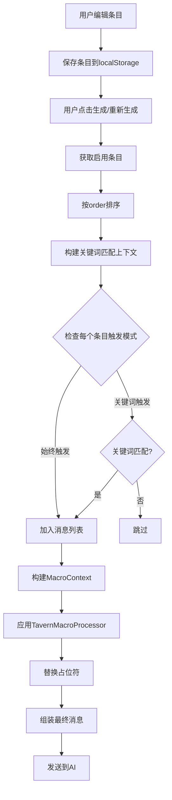

# 正文优化条目设置改进计划

## 任务概述

改进正文优化条目设置，使其支持与酒馆预设相同的占位符系统，添加新的特定占位符，并重构消息组装逻辑。

## 需求分析

### 用户原始需求

1. **占位符支持**：正文优化条目和酒馆预设一样支持占位符
2. **新增占位符**：除原有占位符外，添加额外占位符并添加提示（酒馆预设设置也一起添加）：
   - 本次玩家输入
   - 设置层数的历史优化正文
   - 待优化正文（第一步正文）
3. **移除自动插入**：发送预览里的正文优化和重新正文优化，删除自动插入的（设置层数的历史优化正文；待优化正文）序列，改为用户自己添加
4. **取消深度排序**：按照在发送预览里设置好的消息序列发送，绿灯条目触发后按照原来的相对位置组装进提示词再一起发送

## 技术方案

### 1. MacroContext 类型扩展

**文件**: [`src/types/tavernPreset.ts`](src/types/tavernPreset.ts:184)

```typescript
export interface MacroContext {
  // 现有字段...
  user: string
  char: string
  lastUserMessage: string
  lastCharMessage?: string
  chatHistory?: Array<{ role: string; content: string }>
  variables: Record<string, string>
  worldInfoBefore?: string
  worldInfoAfter?: string
  personaDescription?: string
  charDescription?: string
  charPersonality?: string
  scenario?: string
  dialogueExamples?: string

  // 🔥 新增字段
  playerInput?: string // {{playerInput}} - 本次玩家输入
  sourceText?: string // {{sourceText}} - 待优化正文（第一步正文）
  optimizedHistory?: string[] // 用于 {{optimizedHistory}} 和 {{optimizedHistory::N}}
}
```

### 2. TavernMacroProcessor 扩展

**文件**: [`src/utils/tavernMacros.ts`](src/utils/tavernMacros.ts:183)

在 [`processBasicVariables()`](src/utils/tavernMacros.ts:183) 方法中添加新占位符处理：

```typescript
private processBasicVariables(content: string, context: MacroContext): string {
  let result = content;

  // 现有处理...

  // 🔥 新增：{{playerInput}} - 本次玩家输入
  result = result.replace(/\{\{playerInput\}\}/gi, context.playerInput || '');

  // 🔥 新增：{{sourceText}} - 待优化正文（第一步正文）
  result = result.replace(/\{\{sourceText\}\}/gi, context.sourceText || '');

  // 🔥 新增：{{optimizedHistory}} - 全部历史优化正文
  result = result.replace(/\{\{optimizedHistory\}\}/gi, () => {
    if (!context.optimizedHistory || context.optimizedHistory.length === 0) {
      return '';
    }
    return context.optimizedHistory.join('\n\n---\n\n');
  });

  // 🔥 新增：{{optimizedHistory::N}} - 获取最新N层历史优化正文
  result = result.replace(/\{\{optimizedHistory::(\d+)\}\}/gi, (_, n) => {
    const count = parseInt(n, 10);
    if (!context.optimizedHistory || context.optimizedHistory.length === 0 || count <= 0) {
      return '';
    }
    const selected = context.optimizedHistory.slice(-count);
    return selected.join('\n\n---\n\n');
  });

  return result;
}
```

同时更新 [`hasUnprocessedMacros()`](src/utils/tavernMacros.ts:247) 方法：

```typescript
private hasUnprocessedMacros(content: string): boolean {
  const macroPatterns = [
    /\{\{user\}\}/i,
    /\{\{char\}\}/i,
    /\{\{getvar::/i,
    /\{\{random::/i,
    // 🔥 新增
    /\{\{playerInput\}\}/i,
    /\{\{sourceText\}\}/i,
    /\{\{optimizedHistory\}\}/i,
    /\{\{optimizedHistory::\d+\}\}/i,
  ];
  return macroPatterns.some((pattern) => pattern.test(content));
}
```

### 3. textOptimizationService.ts 修改

**文件**: [`src/services/textOptimizationService.ts`](src/services/textOptimizationService.ts)

#### 3.1 修改 getEnabledEntries() - 按 order 排序

```typescript
// 当前实现（按depth排序）
getEnabledEntries(): TextOptimizationEntry[] {
  const entries = this.getEntries().filter(e => e.enabled);
  // 按depth降序排序（depth越大越靠前）
  entries.sort((a, b) => (b.depth || 0) - (a.depth || 0));
  return entries;
}

// 🔥 修改为按order排序
getEnabledEntries(): TextOptimizationEntry[] {
  const entries = this.getEntries().filter(e => e.enabled);
  // 按order升序排序（保持用户设置的顺序）
  entries.sort((a, b) => (a.order || 0) - (b.order || 0));
  return entries;
}
```

#### 3.2 添加构建 MacroContext 的辅助方法

```typescript
import { TavernMacroProcessor, createDefaultMacroContext } from '@/utils/tavernMacros';
import type { MacroContext } from '@/types/tavernPreset';

/**
 * 构建正文优化场景的宏上下文
 * @param sourceText 待优化正文（第一步正文）
 * @param playerInput 本次玩家输入
 * @param isReroll 是否是重新优化（Re-roll时排除最新层历史）
 * @returns MacroContext
 */
buildOptimizationMacroContext(
  sourceText: string,
  playerInput: string,
  isReroll: boolean = false
): MacroContext {
  // 获取历史优化正文
  const historyCount = this.getHistoryCount();
  // Re-roll时排除最新层，首次优化不排除
  const optimizedHistory = historyCount > 0
    ? this.getOptimizedTextHistory(historyCount, isReroll)
    : [];

  return createDefaultMacroContext({
    playerInput,
    sourceText,
    optimizedHistory,
    lastUserMessage: playerInput,
  });
}
```

#### 3.3 修改 buildOptimizationMessages() - 移除自动插入，应用占位符处理

当前实现中，`buildOptimizationMessages()` 自动插入历史正文和待优化正文：

```typescript
// 当前代码（需要移除）第647-668行
// 🔥 6. 添加历史优化正文上下文（如果有）
const historyCount = this.getOptimizedTextHistoryCount()
if (historyCount > 0) {
  const historyTexts = this.getOptimizedTextHistory(historyCount, isReroll)
  if (historyTexts.length > 0) {
    const historyContent = historyTexts
      .map((text, i) => `【历史优化${i + 1}】\n${text}`)
      .join('\n\n---\n\n')
    messages.push({
      role: 'assistant',
      content: historyContent,
    })
  }
}

// 🔥 7. 原始正文（待优化）
messages.push({
  role: 'user',
  content: `【待优化正文】\n${sourceText}`,
})
```

**修改后**：

```typescript
buildOptimizationMessages(
  sourceText: string,
  playerInput: string = '',
  isReroll: boolean = false
): Array<{ role: 'system' | 'user' | 'assistant'; content: string }> {
  const messages: Array<{ role: 'system' | 'user' | 'assistant'; content: string }> = [];

  // 🔥 构建宏上下文
  const macroContext = this.buildOptimizationMacroContext(sourceText, playerInput, isReroll);
  const macroProcessor = new TavernMacroProcessor();

  // 获取启用的条目（已按order排序）
  const allEntries = this.getEnabledEntries();

  // 🔥 构建关键词匹配上下文
  const latestHistoryText = this.getLatestHistoryText(isReroll);
  const keywordContext = [sourceText, playerInput, latestHistoryText]
    .filter(text => text && text.trim())
    .join('\n\n');

  // 过滤触发的条目（关键词匹配）
  const triggeredEntries = allEntries.filter(entry => {
    if (entry.triggerMode === 'keyword') {
      return this.matchKeywords(entry.keywords || [], keywordContext);
    }
    return true; // 始终触发模式
  });

  // 🔥 按order顺序添加消息（不再按depth排序）
  for (const entry of triggeredEntries) {
    // 应用占位符处理
    const processedContent = macroProcessor.process(entry.content, macroContext);

    if (processedContent.trim()) {
      messages.push({
        role: entry.role,
        content: processedContent
      });
    }
  }

  // 🔥 不再自动插入历史正文和待优化正文
  // 用户需要在条目内容中使用 {{optimizedHistory}} 和 {{sourceText}} 占位符

  return messages;
}
```

### 4. promptPreviewService.ts 修改

**文件**: [`src/services/promptPreviewService.ts`](src/services/promptPreviewService.ts)

#### 4.1 修改 generateTextOptimizationPreview()

**当前实现**（第855-941行）会自动插入"历史优化正文"和"待优化正文"消息。

**修改后**：

```typescript
private async generateTextOptimizationPreview(options?: PreviewOptions): Promise<PreviewResult> {
  const messages: PreviewMessage[] = [];

  const sourceText = options?.step1Text || '（待优化的正文内容将在此显示）';
  const userInput = options?.userInput || '';

  // 获取最新一层历史优化正文（用于关键词匹配）
  const latestHistoryText = textOptimizationService.getLatestHistoryText(false);

  // 构建关键词匹配上下文
  const keywordContext = [sourceText, userInput, latestHistoryText]
    .filter(text => text && text.trim())
    .join('\n\n');

  // 🔥 构建宏上下文（用于占位符处理）
  const macroContext = textOptimizationService.buildOptimizationMacroContext(
    sourceText,
    userInput,
    false  // isReroll = false
  );
  const macroProcessor = new TavernMacroProcessor();

  // 获取正文优化条目（按order排序）
  const allEntries = textOptimizationService.getEnabledEntries();
  const enabledEntries = allEntries.filter(entry => {
    if (entry.triggerMode === 'keyword') {
      return this.matchKeywords(entry.keywords || [], keywordContext);
    }
    return true;
  });

  // 🔥 按order顺序添加消息（保持用户配置的顺序）
  for (let i = 0; i < enabledEntries.length; i++) {
    const entry = enabledEntries[i];
    const triggerInfo = entry.triggerMode === 'keyword' ? ' 🟢' : ' 🔵';

    // 🔥 应用占位符处理
    const processedContent = macroProcessor.process(entry.content, macroContext);

    messages.push(this.createMessage(
      entry.role,
      processedContent,
      `优化条目: ${entry.name}${triggerInfo}`,
      i,  // 使用索引作为顺序标识，不再用于排序
      `optimization_entry_${i}`
    ));
  }

  // 世界书条目（作用于优化）
  const optimizationWorldBooks = this.getWorldBookEntriesForTarget('optimization', sourceText);
  for (let i = 0; i < optimizationWorldBooks.length; i++) {
    const entry = optimizationWorldBooks[i];
    messages.push(this.createMessage(
      entry.role,
      entry.content,
      `世界书: ${entry.name}`,
      enabledEntries.length + i,
      `world_book_optimization_${i}`
    ));
  }

  // 🔥 不再自动插入"历史优化正文"和"待优化正文"消息
  // 用户通过 {{optimizedHistory}} 和 {{sourceText}} 占位符自行控制

  // 🔥 不再按depth排序，保持原始顺序
  // messages.sort((a, b) => b.depth - a.depth);  // 删除此行

  return this.calculateResult(messages);
}
```

#### 4.2 修改 generateTextOptimizationRerollPreview()

类似地修改第946-1044行的 `generateTextOptimizationRerollPreview()` 方法。

### 5. TextOptimizationTab.vue UI 更新

**文件**: [`src/components/dashboard/prompt-management/TextOptimizationTab.vue`](src/components/dashboard/prompt-management/TextOptimizationTab.vue)

#### 5.1 添加占位符帮助区域

在模板中添加占位符说明（参考 TavernPresetTab.vue 的宏变量帮助区域）：

```vue
<!-- 占位符帮助区域 -->
<div class="placeholder-help-section">
  <div class="section-header" @click="showPlaceholderHelp = !showPlaceholderHelp">
    <span class="section-title">📝 占位符变量</span>
    <span class="toggle-icon">{{ showPlaceholderHelp ? '▼' : '▶' }}</span>
  </div>

  <div v-if="showPlaceholderHelp" class="placeholder-content">
    <div class="placeholder-group">
      <h4>🆕 正文优化专用</h4>
      <div class="placeholder-item">
        <code>{{playerInput}}</code>
        <span>本次玩家输入</span>
        <button class="insert-btn" @click="insertPlaceholder('{{playerInput}}')">插入</button>
      </div>
      <div class="placeholder-item">
        <code>{{sourceText}}</code>
        <span>待优化正文（第一步正文）</span>
        <button class="insert-btn" @click="insertPlaceholder('{{sourceText}}')">插入</button>
      </div>
      <div class="placeholder-item">
        <code>{{optimizedHistory}}</code>
        <span>全部历史优化正文</span>
        <button class="insert-btn" @click="insertPlaceholder('{{optimizedHistory}}')">插入</button>
      </div>
      <div class="placeholder-item">
        <code>{{optimizedHistory::N}}</code>
        <span>最新N层历史优化正文（如 {{optimizedHistory::3}} 获取最新3层）</span>
        <button class="insert-btn" @click="insertPlaceholder('{{optimizedHistory::3}}')">插入</button>
      </div>
    </div>

    <div class="placeholder-group">
      <h4>📋 通用变量</h4>
      <div class="placeholder-item">
        <code>{{user}}</code>
        <span>用户名/角色名</span>
        <button class="insert-btn" @click="insertPlaceholder('{{user}}')">插入</button>
      </div>
      <div class="placeholder-item">
        <code>{{char}}</code>
        <span>AI角色名</span>
        <button class="insert-btn" @click="insertPlaceholder('{{char}}')">插入</button>
      </div>
      <div class="placeholder-item">
        <code>{{lastUserMessage}}</code>
        <span>最后一条用户消息</span>
        <button class="insert-btn" @click="insertPlaceholder('{{lastUserMessage}}')">插入</button>
      </div>
      <div class="placeholder-item">
        <code>{{random::选项1::选项2::选项3}}</code>
        <span>随机选择一个选项</span>
        <button class="insert-btn" @click="insertPlaceholder('{{random::}}')">插入</button>
      </div>
    </div>

    <div class="placeholder-group">
      <h4>💾 变量存取</h4>
      <div class="placeholder-item">
        <code>{{setvar::key::value}}</code>
        <span>设置变量</span>
        <button class="insert-btn" @click="insertPlaceholder('{{setvar::名称::值}}')">插入</button>
      </div>
      <div class="placeholder-item">
        <code>{{getvar::key}}</code>
        <span>获取变量</span>
        <button class="insert-btn" @click="insertPlaceholder('{{getvar::名称}}')">插入</button>
      </div>
    </div>
  </div>
</div>
```

#### 5.2 添加快速插入功能

```typescript
// 在 script setup 中添加
const showPlaceholderHelp = ref(false)
const activeTextarea = ref<HTMLTextAreaElement | null>(null)

// 插入占位符到当前编辑的条目
const insertPlaceholder = (placeholder: string) => {
  if (editingId.value) {
    const entry = entries.value.find((e) => e.id === editingId.value)
    if (entry) {
      // 在内容末尾添加占位符
      entry.content = (entry.content || '') + placeholder
      saveEntries()
      toast.success(`已插入 ${placeholder}`)
    }
  } else {
    toast.info('请先点击编辑按钮打开一个条目')
  }
}
```

#### 5.3 考虑移除深度配置

由于深度不再用于排序，可以考虑：

- 隐藏深度输入框，或
- 添加说明文字表明深度已废弃，或
- 保留用于其他目的

### 6. TavernPresetTab.vue 更新

**文件**: [`src/components/dashboard/prompt-management/TavernPresetTab.vue`](src/components/dashboard/prompt-management/TavernPresetTab.vue:94)

在现有宏变量帮助区域中添加新占位符说明：

```vue
<!-- 在现有 placeholder-group 后添加 -->
<div class="placeholder-group">
  <h4>🆕 正文优化专用（适用于优化条目）</h4>
  <div class="placeholder-item">
    <code>{{playerInput}}</code>
    <span>本次玩家输入</span>
  </div>
  <div class="placeholder-item">
    <code>{{sourceText}}</code>
    <span>待优化正文（第一步正文）</span>
  </div>
  <div class="placeholder-item">
    <code>{{optimizedHistory}}</code>
    <span>全部历史优化正文</span>
  </div>
  <div class="placeholder-item">
    <code>{{optimizedHistory::N}}</code>
    <span>最新N层历史优化正文</span>
  </div>
</div>
```

## 消息排序逻辑变更

### 变更前（深度排序）

```
1. 获取所有启用的条目
2. 按 depth 降序排序（depth 越大越靠前）
3. 过滤关键词触发的条目
4. 自动插入历史正文和待优化正文
5. 发送消息
```

### 变更后（顺序保持）

```
1. 获取所有启用的条目（按 order 排序）
2. 过滤关键词触发的条目（保持相对顺序）
3. 对每个条目内容应用占位符处理
4. 按原始顺序发送消息
5. 用户通过 {{sourceText}} 和 {{optimizedHistory}} 控制内容位置
```

### 绿灯条目（关键词触发）处理

```typescript
// 示例：条目顺序 [A, B(绿灯), C, D(绿灯), E]
// 如果 B 和 D 都被触发
// 结果顺序：[A, B, C, D, E] - 保持原始相对位置
```

## 数据流图



## 测试要点

1. **占位符替换测试**
   - 验证 `{{playerInput}}` 正确替换为玩家输入
   - 验证 `{{sourceText}}` 正确替换为第一步正文
   - 验证 `{{optimizedHistory}}` 返回全部历史
   - 验证 `{{optimizedHistory::3}}` 返回最新3层
   - 验证 Re-roll 时历史正确排除最新层

2. **排序测试**
   - 验证条目按 order 顺序显示
   - 验证移动条目后顺序正确
   - 验证关键词触发条目保持相对位置

3. **UI 测试**
   - 验证占位符帮助区域正确显示
   - 验证快速插入功能工作正常
   - 验证预览显示正确

4. **兼容性测试**
   - 验证现有条目数据正常加载
   - 验证没有使用占位符的条目正常工作

## 实施顺序

1. ✅ 分析现有代码结构
2. ⬜ 修改 `MacroContext` 类型定义
3. ⬜ 扩展 `TavernMacroProcessor`
4. ⬜ 修改 `textOptimizationService.ts`
5. ⬜ 修改 `promptPreviewService.ts`
6. ⬜ 更新 `TextOptimizationTab.vue`
7. ⬜ 更新 `TavernPresetTab.vue`
8. ⬜ 测试并调试

## 风险和注意事项

1. **向后兼容**：现有未使用占位符的条目应继续正常工作
2. **性能**：占位符处理应该足够快，不影响用户体验
3. **用户迁移**：需要通知用户自行添加 `{{sourceText}}` 到条目内容中，否则待优化正文不会发送
4. **错误处理**：无效的占位符格式应被安全忽略
