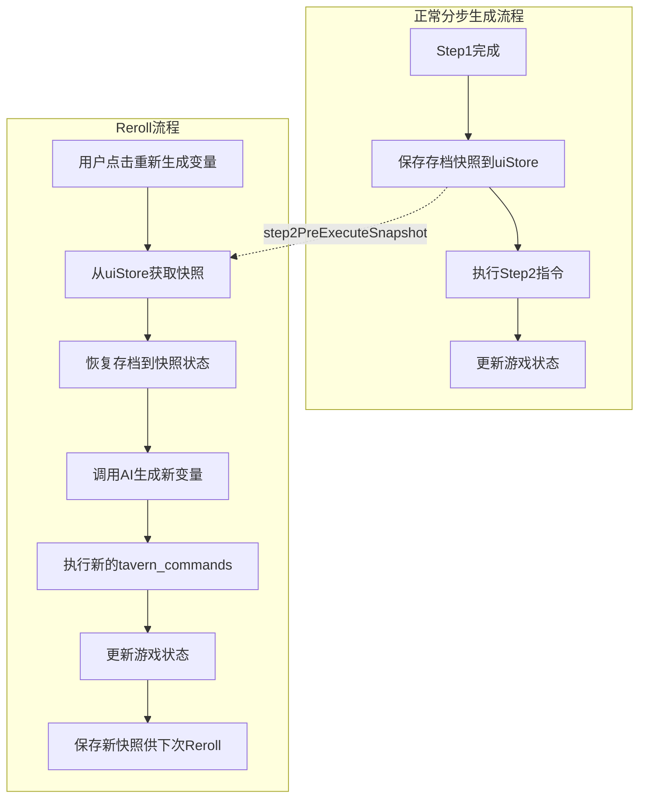

# UI与重Roll功能修复计划

## 问题概述

本文档记录了三个相关的UI和功能问题的分析与修复计划。

---

## 问题1：短期记忆UI与时间栏之间的缝隙

### 问题描述

正文阅读区域最上方的时间栏UI与上面的短期记忆UI框之间存在明显的缝隙。

### 根本原因

在 `MainGamePanel.vue` 中，`.content-area` 类设置了 `padding: 12px 0`，这在内容区域顶部产生了12px的间隙。

### 修复方案

**文件**: `src/components/dashboard/MainGamePanel.vue`
**位置**: 第2290行附近

```css
/* 修改前 */
.content-area {
  padding: 12px 0;
  ...
}

/* 修改后 */
.content-area {
  padding: 0 0 12px 0; /* 只保留底部padding */
  ...
}
```

---

## 问题2：重新优化正文后按钮一直禁用

### 问题描述

点击"重新优化正文"按钮后：

1. 不会进入流式传输显示UI
2. 两个重Roll按钮（"重新生成变量"和"重新优化正文"）会一直进入不能点的禁用状态

### 根本原因

在 `uiStore.ts` 的 `completeRerollOptimization()` 函数中，没有重置 `textOptimizationInProgress` 为 false。

**调用链**：

1. `startRerollOptimization()` 设置 `textOptimizationInProgress = true`
2. `completeRerollOptimization()` 只设置了 `isRerollingOptimization = false`，**遗漏了** `textOptimizationInProgress = false`
3. 按钮的禁用条件检查 `textOptimizationInProgress`，导致永远禁用

**按钮禁用条件** (MainGamePanel.vue:19):

```vue
:disabled="isRerollingStep2 || isRerollingOptimization || splitStep2InProgress ||
textOptimizationInProgress || isAIProcessing"
```

### 修复方案

**文件**: `src/stores/uiStore.ts`
**位置**: 第267行附近

```typescript
// 修改前
function completeRerollOptimization(text: string) {
  isRerollingOptimization.value = false
  textOptimizationText.value = text
  textOptimizationStreamingContent.value = ''
  console.log('[uiStore] 重新优化正文完成，长度:', text.length)
}

// 修改后
function completeRerollOptimization(text: string) {
  isRerollingOptimization.value = false
  textOptimizationInProgress.value = false // 🔥 新增：重置进行中状态
  textOptimizationText.value = text
  textOptimizationStreamingContent.value = ''
  console.log('[uiStore] 重新优化正文完成，长度:', text.length)
}
```

---

## 问题3：变量重Roll后不会替换当前变量数据

### 问题描述

点击"重新生成变量"按钮后，控制台显示AI生成完成，但游戏变量没有被更新。

### 根本原因

在 `AIBidirectionalSystem.ts` 的 `rerollStep2()` 函数中，只返回了解析后的响应数据，但没有执行 `tavern_commands` 指令来更新游戏状态。

**对比正常流程**:

- 正常的 `processPlayerAction` 会调用 `processGmResponse()` 执行指令
- `rerollStep2` 缺少这个调用

### 修复方案：撤销+应用模式

为了确保干净的重新生成，采用"撤销+应用"模式：

1. 在首次执行Step2指令前保存存档快照
2. Reroll时先从快照恢复存档状态
3. 再执行新生成的指令
4. 更新快照供下次Reroll使用



#### 修改1：uiStore.ts - 添加快照存储功能

**新增状态**（在现有状态声明区域添加）:

```typescript
// Step2执行前的存档快照（用于Reroll时恢复）
const step2PreExecuteSnapshot = ref<any>(null)
```

**新增方法**:

```typescript
/**
 * 保存Step2执行前的存档快照
 * 用于Reroll时恢复到干净的状态
 */
function saveStep2Snapshot(saveData: any) {
  step2PreExecuteSnapshot.value = cloneDeep(saveData)
  console.log('[uiStore] 已保存Step2执行前快照')
}

/**
 * 获取Step2执行前的存档快照
 * 返回深拷贝以防止意外修改
 */
function getStep2Snapshot(): any {
  return step2PreExecuteSnapshot.value ? cloneDeep(step2PreExecuteSnapshot.value) : null
}

/**
 * 清除Step2快照
 */
function clearStep2Snapshot() {
  step2PreExecuteSnapshot.value = null
}
```

**在return语句中导出新方法**:

```typescript
return {
  // ... 现有导出 ...
  saveStep2Snapshot,
  getStep2Snapshot,
  clearStep2Snapshot,
}
```

#### 修改2：AIBidirectionalSystem.ts - 在Step2执行前保存快照

**位置**: `processPlayerAction` 函数中，约第561行 `completeSplitStep2()` 调用前

```typescript
// 🔥 在执行Step2指令前保存快照（用于Reroll时恢复）
const preStep2SaveData = gameStateStore.toSaveData()
if (preStep2SaveData) {
  uiStore.saveStep2Snapshot(preStep2SaveData)
}

// 🔥 通知前端第2步完成
uiStore.completeSplitStep2()
```

#### 修改3：AIBidirectionalSystem.ts - 修改rerollStep2实现撤销+应用

**位置**: `rerollStep2` 函数，约第1983行

```typescript
public async rerollStep2(): Promise<any> {
  const uiStore = useUIStore();
  const gameStateStore = useGameStateStore();
  const { aiService } = await import('@/services/aiService');

  // 检查是否可以 Re-roll
  if (!uiStore.canReroll()) {
    console.warn('[AI双向系统] 无法 Re-roll：没有保存的上下文或正在处理中');
    return null;
  }

  const step1Text = uiStore.lastStep1Text;
  const step1Thinking = uiStore.lastStep1Thinking;
  const userInput = uiStore.lastUserInput;

  if (!step1Text) {
    console.warn('[AI双向系统] 无法 Re-roll：没有保存的正文');
    return null;
  }

  console.log('[AI双向系统] 开始重新生成变量（第2步）');
  uiStore.startRerollStep2();

  try {
    // 🔥 从快照恢复存档状态（撤销之前的Step2修改）
    const snapshot = uiStore.getStep2Snapshot();
    if (snapshot) {
      gameStateStore.loadFromSaveData(snapshot);
      console.log('[AI双向系统] 已从快照恢复存档状态');
    } else {
      console.warn('[AI双向系统] 没有找到Step2快照，将直接应用新指令');
    }

    const tavernHelper = getTavernHelper();

    // 🔥 构建简化版的第2步提示词
    const step2RulesPrompt = `
# 分步生成（第2步）规则

你正在执行分步生成的第2步。

## 输出格式：
\`\`\`json
{
  "mid_term_memory": "简洁的记忆总结（1-2句话）",
  "tavern_commands": [
    {"action": "set", "key": "变量路径", "value": "值"}
  ],
  "action_options": ["选项1", "选项2", "选项3"]
}
\`\`\`

## 重要提醒：
- ❌ 禁止输出 "text" 字段（正文已在第1步生成）
- ✅ 只输出 mid_term_memory、tavern_commands、action_options
- tavern_commands 用于更新游戏变量
- action_options 提供 3-5 个合理的后续行动选项
`.trim();

    const step2UserInput = `
【用户本次操作】
${userInput}

【第1步思维链】
${step1Thinking || '（无）'}

【第1步正文】
${step1Text}

请按"分步生成（第2步）"规则输出 JSON。只输出 mid_term_memory、tavern_commands、action_options 三个字段。
`.trim();

    const generationId = `reroll_step2_${Date.now()}`;

    // 构建消息数组
    const messages = [
      { role: 'system' as const, content: step2RulesPrompt },
      { role: 'user' as const, content: step2UserInput }
    ];

    // 调用 AI 生成
    let response: string;
    const actualMode = aiService.getConfig().mode;
    const useTavernAPI = tavernHelper && actualMode === 'tavern';

    if (useTavernAPI && aiService.hasStep2IndependentConfig()) {
      response = await aiService.generateWithStep2Config({
        ordered_prompts: messages,
        should_stream: false,
        generation_id: generationId,
      });
    } else if (useTavernAPI) {
      response = await tavernHelper.generate({
        user_input: step2UserInput,
        should_stream: false,
        generation_id: generationId,
      });
    } else if (aiService.hasStep2IndependentConfig()) {
      response = await aiService.generateWithStep2Config({
        ordered_prompts: messages,
        should_stream: false,
        generation_id: generationId,
      });
    } else {
      response = await aiService.generate({
        ordered_prompts: messages,
        should_stream: false,
        generation_id: generationId,
      });
    }

    // 解析响应
    const parsedStep2 = this.parseAIResponse(String(response));

    // 🔥 执行新的指令以更新游戏状态
    const currentSaveData = gameStateStore.toSaveData();
    if (currentSaveData && parsedStep2.tavern_commands && parsedStep2.tavern_commands.length > 0) {
      console.log('[AI双向系统] 执行新的tavern_commands，数量:', parsedStep2.tavern_commands.length);
      await this.processGmResponse(parsedStep2, currentSaveData);

      // 🔥 保存新的快照供下次Reroll使用
      const newSnapshot = gameStateStore.toSaveData();
      if (newSnapshot) {
        // 保存Step2执行前的状态（当前的snapshot），不是执行后的状态
        // 这样下次Reroll时可以恢复到干净状态
      }
    } else {
      console.log('[AI双向系统] 没有tavern_commands需要执行');
    }

    console.log('[AI双向系统] ✅ 重新生成变量完成');
    uiStore.completeRerollStep2();

    return parsedStep2;
  } catch (error) {
    console.error('[AI双向系统] ❌ 重新生成变量失败:', error);
    uiStore.completeRerollStep2();
    throw error;
  }
}
```

---

## 修改文件清单

| 文件                                         | 修改内容                                                                                              |
| -------------------------------------------- | ----------------------------------------------------------------------------------------------------- |
| `src/components/dashboard/MainGamePanel.vue` | 修改 `.content-area` 的 padding                                                                       |
| `src/stores/uiStore.ts`                      | 1. 在 `completeRerollOptimization` 中添加 `textOptimizationInProgress = false`<br>2. 添加快照存储功能 |
| `src/utils/AIBidirectionalSystem.ts`         | 1. 在Step2执行前保存快照<br>2. 修改 `rerollStep2` 实现撤销+应用逻辑                                   |

---

## 验证步骤

1. **问题1验证**：检查短期记忆框和时间栏之间是否还有缝隙
2. **问题2验证**：
   - 点击"重新优化正文"按钮
   - 确认流式传输正常显示
   - 确认完成后两个按钮恢复可点击状态
3. **问题3验证**：
   - 执行一次正常的游戏回合
   - 点击"重新生成变量"按钮
   - 确认旧的变量被撤销
   - 确认新的变量被正确应用
   - 再次点击"重新生成变量"，确认可以多次Reroll

---

## 创建日期

2026-01-04

## 状态

待实施
